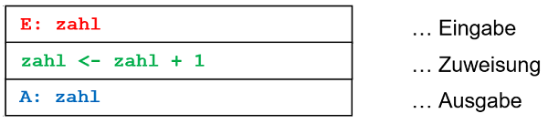

# Allgemeines <!-- omit in toc -->

Dieses Skriptum umfasst den Unterrichtsstoff für POS (Programmieren und Software Engineering) des ersten Jahrgangs der Abteilung Informatik an der Höheren Technischen Bundeslehranstalt Kaindorf, Österreich. 

Als Erweiterung dieses Skriptums steht das frei verfügbares Lehrbuch zur Programmiersprache C des Rheinwerk Verlags zur Verfügung:  
[Wolf, Jürgen: C von A bis Z](https://openbook.rheinwerk-verlag.de/c_von_a_bis_z/)

Werden die Grundlagen beherrscht, können die Programmierfähigkeiten auf folgenden Seiten perfektioniert werden: 

[Project Euler](https://projecteuler.net/)  
[CodinGame](https://www.codingame.com/start)  

# Inhaltsverzeichnis <!-- omit in toc -->

- [1. Einführung](#1-einführung)
  - [1.1. Wichtige Begriffe](#11-wichtige-begriffe)
  - [1.2. Geschichte von C](#12-geschichte-von-c)
  - [1.3. Installation von Visual Studio Code](#13-installation-von-visual-studio-code)
  - [1.4. Erstes Programm mit Visual Studio Code (VSC)](#14-erstes-programm-mit-visual-studio-code-vsc)
  - [1.5. `helloworld.c` kompilieren](#15-helloworldc-kompilieren)
  - [1.6. `helloworld.c` starten/debuggen](#16-helloworldc-startendebuggen)
  - [1.7. Einführungsbeispiel](#17-einführungsbeispiel)
- [2. Mein erstes Programm mit Eingabe, Zuweisung und Ausgabe](#2-mein-erstes-programm-mit-eingabe-zuweisung-und-ausgabe)
  - [2.1. `printf()`-Befehl: Steuerzeichen und Sonderzeichen](#21-printf-befehl-steuerzeichen-und-sonderzeichen)
  - [2.2. Struktogramm](#22-struktogramm)
- [3. Operatoren – 1. Teil](#3-operatoren--1-teil)
  - [3.1. Zuweisungsoperator](#31-zuweisungsoperator)
    - [3.1.1. Variablentausch mit Hilfsvariable](#311-variablentausch-mit-hilfsvariable)
  - [3.2. Variablentausch ohne Hilfsvariable](#32-variablentausch-ohne-hilfsvariable)
  - [3.3. Arithmetische Operatoren](#33-arithmetische-operatoren)
  - [3.4. Vorzeichenoperatoren](#34-vorzeichenoperatoren)
    - [3.4.1. Binäre arithmetische  Operatoren](#341-binäre-arithmetische--operatoren)
- [4. Datentypen](#4-datentypen)
- [5. Zufallszahlen](#5-zufallszahlen)
- [6. `printf()`-Befehl: Formatierte Ausgabe](#6-printf-befehl-formatierte-ausgabe)
- [7. Mathematische Funktionen – `<math.h>`](#7-mathematische-funktionen--mathh)
- [8. Kommentare](#8-kommentare)
- [9. Character- und Stringliterale](#9-character--und-stringliterale)
  - [9.1. Characterliterale](#91-characterliterale)
  - [9.2. Stringliterale](#92-stringliterale)
- [10. Operatoren – 2. Teil](#10-operatoren--2-teil)
- [11. Arrays (Felder)](#11-arrays-felder)
  - [11.1. Eindimensionale Arrays](#111-eindimensionale-arrays)
  - [11.2. Eindimensionale Arrays dynamisch erzeugen](#112-eindimensionale-arrays-dynamisch-erzeugen)
  - [11.3. Mehrdimensionale Arrays](#113-mehrdimensionale-arrays)
  - [11.4. Übergabe von mehrdimensionalen Arrays an Funktionen](#114-übergabe-von-mehrdimensionalen-arrays-an-funktionen)
  - [11.5. Mehrdimensionale Arrays dynamisch erzeugen](#115-mehrdimensionale-arrays-dynamisch-erzeugen)
- [12. Anhang](#12-anhang)
  - [12.1. Weitere Literatur](#121-weitere-literatur)
  - [12.2. Übersicht des Unterrichtsstoffs](#122-übersicht-des-unterrichtsstoffs)

# 1. Einführung

## 1.1. Wichtige Begriffe 

Ein **Programm** ist eine Abfolge von Befehlen/Anweisungen in einer bestimmten Programmiersprache. 

Ein **Compiler** übersetzt ein Programm, geschrieben in einer  Programmiersprache (z.B. C, Java, Python) in Maschinensprache (`01100010001`…). 

Ein **Debugger** dient zur Fehlersuche in Programmen. 

Eine **Entwicklungsumgebung** oder **IDE** (*Integrated Development Environment*) wie z.B. Visual Studio Code oder IntelliJ unterstützt Programmierer beim 
* Schreiben, 
* Debuggen,  
* Compilieren und 
* Ausführen 

von Programmen. 

Jede Programmiersprache stellt **Befehle** für: 
1.	Eingabe
2.	Ausgabe
3.	Mathematische Operationen
4.	Entscheidungen
5.	Schleifen  

zur Verfügung. 

Zudem stellt jede Programmiersprache **Datentypen** für 
* Ganze Zahlen
* Gleitkommazahlen
* Einen logischen Datentyp
* Zeichen und Zeichenketten (String)

bereit. 

## 1.2. Geschichte von C 
C ist eine imperative und prozedurale Programmiersprache. C wurde 1972 „erfunden“ und seit damals in Varianten weiterentwickelt. Das *American National Standards Institute* (ANSI) vereinheitlichte die C-Varianten und veröffentlichte 1989 ein standardisiertes C. Dieser C-Standard wird im Sprachgebrauch als C89 bzw. ANSI-C bezeichnet. Dieser C-Standard wurde auch von der *International Organization for Standardization* (ISO) übernommen und im Sprachgebrauch mit C90 bezeichnet. 

Im Jahr 1999 erschien C99 mit Elementen der objekt-orientierten Programmiersprache C++. 

## 1.3. Installation von Visual Studio Code 

**#TO-BE-UPDATED Today**  

**Achtung**: Den Open-Source-Code-Editor Microsoft **Visual Studio Code** nicht mit der viel umfangreicheren integrierten Entwicklungsumgebung (IDE) „Visual Studio 2019“ verwechseln. 

Hier der Download-Link:  
https://code.visualstudio.com/ 

Mingw-w64 (oder **Mingw64**) ist eine Portierung der Linux-Entwicklerwerkzeuge GNU Compiler Collection (GCC) und GNU Debugger (GDB) auf Windows.  

Homepage: http://mingw-w64.org/

Hier der Download-Link:  
https://sourceforge.net/projects/mingw-w64/files/Toolchains%20targetting%20Win32/Personal%20Builds/mingw-builds/installer/mingw-w64-install.exe 

Wie starte ich Visual Studio Code? Einfach in der Windows-Suche “code“ eingeben und App öffnen.  
Wichtig ist noch: Menü „View“ und „Extensions“ öffnen. Im Suchfeld „c++“ eingeben und die **C/C++ Extension** von Microsoft installieren: 


Danach noch **Umgebungsvariable** konfigurieren (https://code.visualstudio.com/docs/cpp/config-mingw):   	
Windows-Suche: “Einstellungen“  
Suchfeld: „Umgebungsvariablen für dieses Konto bearbeiten“  
Variable `Path` auswählen und „Bearbeiten…“ drücken  	
Drücke „Neu“ und füge den Pfad zum „\bin“-Verzeichnis deiner mingw-w64-Installation hinzu (z.B. C:\Program Files (x86)\mingw-w64\i686-8.1.0-posix-dwarf-rt_v6-rev0\mingw32\bin) 

**Installation und Konfiguration prüfen**: 	
Visual Studio Code starten: Windows-Suche: „code“ eingeben.  
Terminal (Konsole) öffnen: Menü „View -> Terminal“  
In der Kommando-Zeile „g++ --version“ eingeben:  


## 1.4. Erstes Programm mit Visual Studio Code (VSC)

In Windows-Suche „cmd“ eingeben und Eingabeaufforderung öffnen. 

Projektverzeichnis erstellen und VSC starten: 

```
mkdir projects
cd projects
mkdir helloworld
cd helloworld
code .
```

Quelldatei “helloworld.c” erstellen: 


```c
// #include bewirkt das Einfügen von Quellcode aus einer anderen  
// Datei. Die Header-Datei stdio.h wird in das Programm eingefügt.  
// Sie beinhaltet die Funktionen, die wir zur 
// (Standard)-Ein/-Ausgabe benötigen 
#include <stdio.h>                          

int main()         // Funktion main() definiert das Hauptprogramm
{                  // definiert den Anfang der Funktion
  printf("Hello World!\n");        // Aufruf der Funktion printf()
  printf("Press a key to continue... ");
  fflush(stdin);
  getchar();
  return 0;                    // Rückgabewert der Funktion main()
}                              // definiert das Ende der Funktion
```

Datei speichern: Menü File -> Save 

## 1.5. `helloworld.c` kompilieren 
Um VSC zu sagen, wie die Quelldatei helloworld.c nun zu kompilieren ist, braucht es eine tasks.json Datei: 	

Menü Terminal -> Configure Default Build Task…, “C/C++:gcc.exe build active file” auswählen. 

Quelldatei helloworld.c auswählen  


und mit der Tastenkombination Strg+Shift+b kompilieren. 

## 1.6. `helloworld.c` starten/debuggen 

Um helloworld.c starten oder debuggen zu können, braucht VSC die Datei launch.json: 

Menü Run -> Add Configuration…, „C++ (GDB/LLDB)“ und “gcc.exe – Aktive Datei erstellen und debuggen“ auswählen. 

Das Programm wird anschließend gleich ausgeführt was man mit der Tastenkombination Shift+F5 stoppen kann. 

Quelldatei helloworld.c auswählen 

 

und mit der Tastenkombination Strg+F5 starten. 

Will man das Programm debuggen, an geeigneter Stelle einen Breakpoint setzen und das Programm mit der Taste F5 starten: 

 

## 1.7. Einführungsbeispiel 

Lernt man eine neue Programmiersprache, dann ist meist ein „Hello World“ Programm, das erste Programm, das man schreibt. Und das machen wir im folgenden Einführungsbeispiel genauso. 

Das folgende „Hello World“ Programm zeigt die grundlegende Struktur eines C-Programms: 

```c 
// #include bewirkt das Einfügen von Quellcode aus einer anderen 
// Datei. Die Header-Datei stdio.h wird in das Programm eingefügt. 
// Sie beinhaltet die Funktionen, die wir zur 
// (Standard)-Ein/-Ausgabe benötigen 
#include <stdio.h>                        

int main()          // Funktion main() definiert das Hauptprogramm
{                   // definiert den Anfang der Funktion
  printf ("Hello World!\n");       // Aufruf der Funktion printf()
  return 0;         // Rückgabewert der Funktion main()
}                   // definiert das Ende der Funktion
```
**Erklärungen:**

* die Funktion `main()` muss in jedem C-Programm genau einmal vorhanden sein 
* die geschweiften Klammern definieren einen Funktionskörper oder Block 
* `printf()` ist eine Funktion zur formatierten Ausgabe auf der Konsole 
* Parameter der Funktion `printf()` ist hier der String `"Hello World!\n"`
Die Datei `stdio.h` muss inkludiert sein.
* die Zeichenkombination `'\n'` ist das Steuerzeichen für „Zeilenende“  
* Jede Anweisung wird mit `;` beendet 
* Mehrzeilige Kommentare werden in `/*` und `*/` eingeschlossen
* Einzeilige Kommentare beginn mit `//` und erstrecken sich bis zum Zeilenende
* C unterscheidet zwischen Groß- und Kleinschreibung 

Das folgende Listing zeigt eine modifizierte Version des „Hello World“ Programms:

```c 
#include <stdio.h>
int main()
{
  printf ("Hello");
  printf (" World!");
  printf ("\n");
  return 0;
}
```

# 2. Mein erstes Programm mit Eingabe, Zuweisung und Ausgabe 

Im folgenden Listing werden zuerst 

* Die Variable a vom Datentyp `int` (Integer … Ganzzahl) 
* Die Variable x vom Datentyp `float` (Float … Fließkommazahl) 
* Die Variable y vom Datentyp `double` (Double float … Fließkommazahl mit doppelter Genauigkeit) 

definiert.

Danach wird dem Anwender mit dem `printf()`-Befehl ausgegeben, dass er bitte entsprechende Zahlen eingibt.  
Mit dem `scanf()`-Befehl werden die Eingaben des Anwenders der jeweils passenden Variable (`a`, `x` und `y`) zugewiesen.  
Zum Schluss werden die Werte der Variablen (`a`, `x` und `y`) dem Anwender mit dem `printf()`-Befehl an der Konsole ausgegeben. 

```c
#include <stdio.h>

int main()
{
    int a;
    float x;
    double y;
    printf("Bitte eine ganze Zahl eingeben: ");
    scanf("%d", &a);
    printf("Bitte eine Kommazahl eingeben : ");
    scanf("%f", &x);
    printf("Bitte eine grosse Kommazahl eingeben: ");
    scanf("%lf", &y);
    printf("-------------------------------\n");
    printf("a = %d\n", a);
    printf("x = %f\n", x);
    printf("y = %lf\n", y);
    return 0;
}
```

Erklärungen: 

* Beim `scanf()`-Befehl, dienen `%d`, `%f` und `%lf` als Platzhalter, um den vom Anwender eingegebenen Wert einzulesen und der Variable `a`, `x` bzw. `y` zuzuweisen. 
* `%d` ist ein Platzhalter für eine Ganzzahl (d … decimal) 
* `%f` ist ein Platzhalter für eine Fließkommazahl (f … float) 
* `%lf` ist ein Platzhalter für eine Fließkommazahl  mit doppelter Genauigkeit (lf … long float) 
* Die Platzhalter für die Ausgabe der Variablen `a`, `x` und `y` mit dem `printf()`-Befehl sind gleich wie beim `scanf()`-Befehl. 
* Das `&`-Zeichen im scanf()-Befehl wird zu einem späteren Zeitpunkt erklärt. 

## 2.1. `printf()`-Befehl: Steuerzeichen und Sonderzeichen 

Sogenannte Escape-Sequenzen ermöglichen Steuerzeichen und Sonderzeichen auszugeben. Eine Escape-Sequenz wird durch einen Backslash `\`  eingeleitet, dem ein weiteres Zeichen folgt. Eine Escape-Sequenz gilt trotzdem als einzelnes Zeichen.
In der folgenden Tabelle sind die wichtigsten Escape-Sequenzen aufgelistet: 

| Escape-Sequenz | Bedeutung |
| --- | --- |
| `\n` | Zeilenumbruch |
| `\t` | Tabulator |
| `\'` | Einfaches Hochkomma |
| `\"` | Doppeltes Hochkomma |
| `\?` | Fragezeichen |
| `\\` | Backslash |
| `\0` | NULL zum Terminieren von Strings |
| `\b` | Backspace - Zurücksetzen um ein Zeichen |
| `\f` | Formfeed - Seitenumbruch |
| `\a` | Piepston |

## 2.2. Struktogramm 

Mit Struktogrammen, auch Nassi-Shneiderman-Diagramme genannt, werden Programme unabhängig von der Programmiersprache, mit der sie letztendlich umgesetzt werden, entworfen.   
Ein Struktogramm setzt sich aus Strukturblöcken zusammen. Diese können, wie wir noch sehen werden, ineinander verschachtelt sein. 

Beispiel eines Struktogramms mit Sequenz-Symbolen: 

 

**Aufgabe**: Lese eine Ganzzahl ein, erhöhe diese um eins und gib die Zahl aus. 

Struktogramm: 

 

Programm: 

```c
#include <stdio.h>

int main()
{
    int zahl;                        // ROT  
    printf("Ganze Zahl: ");          // ROT
    scanf("%d", &zahl);              // ROT
    zahl = zahl + 1;                 // GRÜN
    printf("Ergebnis: %d\n", zahl);  // BLAU
    return 0;
}
```

**Vorteil von Struktogrammen**:  
Man braucht sich beim Entwurf des Programms noch nicht mit Befehls- und Datentypdetails einer Programmiersprache auseinandersetzen. 

# 3. Operatoren – 1. Teil  

Es gibt in C drei Arten von Operatoren:
* Unäre Operatoren: benötigen nur einen Operanden, wie z.B. die Vorzeichenoperatoren `+` und `-`.
* Binäre Operatoren: benötigen zwei Operanden
* Ternäre Operatoren: benötigen drei Operanden

Im folgenden Abschnitt werden die wichtigsten Operatoren beschrieben:

## 3.1. Zuweisungsoperator 

Der Zuweisungsoperator `=` weist der Variablen auf der linken Seite den Wert des Ausdrucks der rechten Seite zu. 

### 3.1.1. Variablentausch mit Hilfsvariable 

Oft müssen die Inhalte zweier Variablen (z.B. a, b) vertauscht werden. Am einfachsten macht man das mit einer Hilfsvariablen h: 

```c
int a, b, h; 
...
h=a;
a=b;
b=h;
```

## 3.2. Variablentausch ohne Hilfsvariable 

Mathematikfüchse kommen ohne Hilfsvariable aus: 

```c 
int a, b; 
...
a=a+b;
b=a-b;
a=a-b;
```

## 3.3. Arithmetische Operatoren 

## 3.4. Vorzeichenoperatoren

Zur Darstellung der mathematischen Vorzeichen 'plus' und 'minus' werden die unären Vorzeichenoperatoren `+` und `–` verwendet.

```c
int z1, z2;
z1 = +5;
z2 = -9;
```
### 3.4.1. Binäre arithmetische  Operatoren

| Operator | Bedeutung |
| :---: | --- |
| `+` |	Addition |
| `-` |	Subtraktion |
| `*` |	Multiplikation |
| `/` |	Division |
| `%` |	Modulo-Division |

Regeln für die arithmetischen Operatoren: 

Wie in der Mathematik gilt Punkt- vor Strichrechnung, wobei der Modulooperator ein Punktoperator ist.

Gleichrangige Operatoren werden von links nach rechts ausgewertet.

* Sind beide Operanden vom selben Datentyp so ist auch das Ergebnis der Berechnung von diesem Datentyp, mindestens jedoch vom Typ `int`.
  
Sind die Operanden von unterschiedlichen Datentypen so ist das Ergebnis vom größeren der beiden Datentypen.
* Der Modulooperator ist nur für ganzzahlige Operanden zulässig. Das Ergebnis ist der ganzzahlige Rest der Division: `17 % 5 = 2`.
Bei den Divisionsoperatoren (`/` und `%`) führt eine Divison durch `0` zu einem Laufzeitfehler.

# 4. Datentypen

In C gibt es 4 Grunddatentypen. Deren Größe und Wertebereich sind nicht normiert. Bei den meisten Systemen gelten aber folgende Werte: 

| Name | Datentyp | Bytes |	Minimalwert | Maximalwert
| --- | --- | :---: | --- | --- |
| `int` | Ganze Zahl | 4 | -2147483648 (= $-2^{31}$) | 2147483647 (= $+2^{31}-1$) | 
| `char` | Ein Zeichen | 1 | -128 (= $-2^7$) | 127 (= $+2^7-1$) |
| `float` |	Fließkommazahl, 6-stellige Genauigkeit | 4 | 1.175494E-038 | 3.402813E+038 | 
| `double` | Große Fließkommazahl, 15-stellige Genauigkeit | 8 | 2.225074E-308 | 1.797693E+308 |

In C existiert kein logischer Datentyp (Datentyp boolean)! Stattdessen werden Variablen vom Datentyp int für Bedingungen verwendet werden, wobei folgende Regeln gelten:

Variablenwert gleich 0 -> `FALSE`  
Variablenwert ungleich 0 -> `TRUE`

Alle Variablen müssen vor ihrer Verwendung deklariert werden. Die Deklaration legt den Namen und den Typ fest. Deklarationen müssen immer am Anfang eines Programms stehen. 

# 5. Zufallszahlen 

Zum Erzeugen von ganzzahligen Zufallszahlen stehen in der C Standard Library `<stdlib.h>` folgende Funktionen zu Verfügung:

```c 
srand(<seed>)       // Anweisung zum Erzeugen eines Zufallszahlen-Seeds
srand(time(NULL))   // Erzeugen eines Zufallszahlen-Seeds,  
                    // initialisiert mit der aktuellen Systemzeit   
rand()              // Erzeugen einer ganzzahligen Zufallszahl
```

Für die Funktion `time()` muss zusätzlich die Datei `<time.h>` inkludiert werden. Die Funktion `srand()` definiert den Startwert (Seed) zum Erzeugen der Zufallszahlen. Durch die Übergabe der Funktion `time()` an `srand()` wird sichergestellt, dass bei jedem Programmstart neue Zufallszahlen erzeugt werden. 
Die Funktion `rand()` gibt eine Zufallszahl im Bereich von `[0,RAND_MAX]` zurück. Wobei die symbolische Konstante `RAND_MAX` dem Wert 32767 entspricht. Durch Verwendung des Modulo-Operators (`%`) kann der Wertebereich eingeschränkt werden. 

Benötigt man eine Zufallszahl im Intervall `[Untergrenze, Obergrenze]` gilt folgende Formel: 
```c 
rand()%(Obergrenze + 1 – Untergrenze) + Untergrenze
```
Im folgenden Beispiel wird eine Zufallszahl zwischen `[1, 100]` erzeugt:

```c
#include <stdlib.h>
#include <time.h>

int main()
{
  int zz;
  srand(time(NULL));
  zz = rand()%100 + 1; 
}
```

Wird eine Zufallszahl vom Datentyp `double` benötigt, so lässt sich folgende Formel anwenden: 

```c 
(double)rand()/RAND_MAX*(Obergrenze – Untergrenze) + Untergrenze
```

Im folgenden Beispiel wird eine Zufallszahl zwischen `[1.0, 5.0]` erzeugt:

```c 
#include <stdlib.h>
#include <time.h>

int main()
{
  double zz;
  srand(time(NULL));
  zz = (double)rand()/RAND_MAX*(5.0-1.0) + 1.0; 
}
```
# 6. `printf()`-Befehl: Formatierte Ausgabe 

Die formatierte Ausgabe auf der Konsole erfolgt mit dem `printf()`-Befehl, der in der Headerdatei `<stdio.h>` definiert ist: 

```c
int printf("Formatstring" [ , argument1, argument2 ...]); 
```

Der erste Parameter dient zur Übergabe eines Formatstrings. Die weiteren Parameter sind optional (eckige Klammern bedeuten optional) und sind die Argumente für den Formatstring. Die Formatierung erfolgt entsprechend den Angaben im Formatstring. Der Rückgabewert des `printf()`-Befehls ist die Anzahl der ausgegebenen Zeichen.

Der Formatstring enthält sowohl normalen Text als auch Platzhalter mit den jeweiligen Formatangaben. Die Syntax für einen Platzhalter sieht wie folgt aus:

``` 
%[flag][width][.precision]conversion
```

Der wichtigste und einzige nicht optionale Teil ist dabei das Umwandlungszeichen (conversion), das den Datentyp für die Umwandlung bestimmt:

| `conversion` | Datentyp | Bedeutung |
| --- | --- | --- | 
| `d`, `i` | int | Integer |
| `f` | float | Gleitkommazahl float - Default von 6 Kommastellen |
| `lf` | double	| Gleitkommazahl double - Default von 6 Kommastellen |
| `%` | | Ausgabe des % Zeichens |


Die Flags sind optional und werden unmittelbar nach dem `%`-Zeichen angegeben:


| `flag` | Bedeutung | 
| --- | --- |
| `-` |	Ausgabe linksbündig |
| `+` |	Ausgabe mit Vorzeichen |
| `0` |	Leerzeichen werden mit Nullen gefüllt |

Die Anzahl der auszugebenden Zeichen ist optional und wird durch die Breite (`width`) festgelegt. 

Die Anzahl der Nachkommastellen ist optional und wird durch die Genauigkeit (`precision`) festgelegt. 

Beispiele von Formatangaben für ganzzahlige Werte (Datentyp `int`): 

```
%d 		Ausgabe der Zahl ohne zusätzliche Vorgabe 
%5d 	rechtsbündige Ausgabe der Zahl auf 5 Stellen 
%-5d 	linksbündige Ausgabe der Zahl auf 5 Stellen 
%05d 	Ausgabe der Zahl auf 5 Stellen mit führenden Nullen 
%+5d 	rechtsbündige Ausgabe der Zahl auf 5 Stellen mit Vorzeichen 
%+-5d   linksbündige Ausgabe der Zahl auf 5 Stellen mit Vorzeichen 
```

Beispiele von Formatangaben für Fließkommazahlen (Datentyp `float`):

```
%f 		    Ausgabe der Zahl ohne zusätzliche Vorgabe 
%10f 		rechtsbündige Ausgabe der Zahl auf 10 Stellen
%.2f 		rechtsbündige Ausgabe der Zahl mit 2 Nachkommastellen 
%-10.2f 	linksbündige Ausgabe auf 10 Stellen, davon 2 Nachkommastellen 
%010.2f 	Ausgabe der Zahl auf 10 Stellen mit führenden Nullen, davon 2       
            Nachkommastellen
%+10.2f 	rechtsbündige Ausgabe der Zahl auf 10 Stellen, davon mit Vorzeichen und 2 
		    Nachkommastellen
%+-.2f 	    linksbündige Ausgabe der Zahl mit Vorzeichen und 2 Nachkommastellen
```
# 7. Mathematische Funktionen – `<math.h>`

In der Headerdatei `<math.h>` sind folgende nützliche mathematische Funktionen und Konstanten deklariert: 

```
double pow(double x, double y)	// x hoch y
double sqrt(double x)	        // Wurzel aus x
double fabs(double z)           // Absolutwert von x
double sin(double x)	        // Sinus von x
double cos(double x)	        // Cosinus von x
double tan(double x)	        // Tangens von x
double exp(double x)	        // Exponentialfunktion e hoch x
double log(double x)	        // Nat. Logarithmus von x

M_PI 	// symbolische Konstante für PI
M_PI_2 	// symbolische Konstante für PI/2
M_PI_4 	// symbolische Konstante für PI/4
M_E 	// symbolische Konstante für e 
```

Fürs kaufmännisch Runden, Abschneiden, Abrunden und Aufrunden stehen folgende Funktionen zur Verfügung: 

```
double round(double x);  // Kaufmännisch Runden 
double trunc(double x);  // Kommazahlen abschneiden
double floor(double x);  // auf nächste Ganzzahl abrunden 
double ceil(double x);	 // auf nächste Ganzzahl aufrunden 
```

Im folgenden Beispiel wird die Verwendung der Funktionen veranschaulicht: 

```c
#include <stdlib.h>
#include <math.h>

int main()
{
    double x1, x2, y1, y2; 
    x1 = 5.23487392;
    x2 = 5.89437524;
    y1 = round(x1 * 1000)/1000;  // ergibt 5.235000
    y2 = round(x2 * 1000)/1000;  // ergibt 5.894000
    y1 = trunc(x1);              // ergibt 5.000000
    y1 = floor(x1);              // ergibt 5.000000 
    y1 = ceil(x1);               // ergibt 6.000000 
} 
```

Kaufmännisch Runden und Abschneiden ist auch durch explizite Typumwandlung möglich: 

```c
#include <stdio.h>

int main()
{
    double x1, x2; 
    int y1, y2; 
    double y3, y4; 
    x1 = 5.23487392;
    x2 = 5.89437524;
    // Kaufmännisch Runden:
    y1 = (int)(x1 + 0.5);                // ergibt 5
    y2 = (int)(x2 + 0.5);                 // ergibt 6
    // auf z.B. 3 Kommastellen Runden:
    y3 = (int)(x1 * 1000 + 0.5)/1000.0;  // ergibt 5.235000
    y4 = (int)(x2 * 1000 + 0.5)/1000.0;  // ergibt 5.894000
    // Kommastellen abschneiden:
    y1 = (int)x1;                        // ergibt 5
    // Zahl nach z.B. der 3. Kommastelle abschneiden:
    y3 = (int)(x1 * 1000)/1000.0;        // ergibt 5.234000    
} 
```

# 8. Kommentare 

Regeln für Kommentare:

* Mehrzeilige Kommentare werden mit `/*` eingeleitet und mit `*/` abgeschlossen.
* Einzeilige Kommentare beginnen mit `//` und erstrecken sich bis zum Ende der Zeile.
* Kommentare können an beliebiger Stelle stehen.

# 9. Character- und Stringliterale 

## 9.1. Characterliterale

Die Zuweisung erfolgt durch genau ein Zeichen, das in einfachen Anführungszeichen eingeschlossen wird. Auf der char-Variablen wird der entsprechende ASCII-Wert des Zeichens gespeichert. 

```c 
char c1, c2, c3;

c1 = 'A';     	// numerischer Wert 65
c1 = 65;      	// identisch zur vorherigen Anweisung
c2 = 'F';     	// numerischer Wert 70
c3 = '1';     	// numerischer Wert 49
c4 = '\n';      // Zeilenumbruch
```

Zu den Characterliteralen gehören auch die Sonder- und Steuerzeichen, die mit einem Backslash '`\`'  eingeleitet werden (Escape-Sequenz) und trotzdem als einzelne Zeichen gelten. 

Das Umwandlungszeichen (conversion), um Characterliterale einzulesen bzw. auszugeben lautet „c“: 

```c
char zeichen; 
scanf("%c", &zeichen);
printf("%c", zeichen);
```

## 9.2. Stringliterale

Für Strings gibt es in C keinen eigenen Datentyp, daher müssen Zeichenketten in Form von `char`-Arrays behandelt werden.

Folgende Eigenschaften gelten für Zeichenketten:

* Sie bestehen aus einer Folge von Einzelzeichen. 
* Sie werden in doppelte Anführungszeichen eingeschlossen:	
 "Das ist eine Zeichenkette". 
* Am Ende muss ein NULL-Zeichen ('`\0`') zur Kennzeichnung des Endes angehängt werden.
Es gelten die gleichen Escape-Sequenzen wie bei einzelnen Zeichen.
* Zeichenketten können über Zeilengrenzen gehen, wenn unmittelbar vor dem Zeilentrenner ein Backslash '`\`' steht. 
Sie können einem Charaterfeld (char-Array) zugewiesen werden.
Sie dürfen nur bei der Initialisierung oder beim Einlesen zugewiesen werden, nicht aber zu einem späteren Zeitpunkt.

```c 
char str1[100] = "";
char str2[] = { "Hallo" };
char str3[] = { 'H', 'a', 'l', 'l', 'o', '\0' };
char str4[] = { 72, 97, 108, 108, 111, 0 }; 
char str2[20] = "Teil 1\
                 Teil2";       // Der Zeilenumbruch ist auf dem String nicht sichtbar

str1 = "ungültige Zuweisung";  // Compilerfehler!
```

Das Umwandlungszeichen (conversion), um Stringliterale auszugeben lautet „`%s`“: 

```c 
char str1[] = { "Hallo" };
printf("%s", str1);
```

Fürs Einlesen von Stringliteralen von der Konsole stehen die beiden Befehle `gets(s, max)` und `scanf("%s, s)` zur Verfügung: 

```c
char str1[100] ="";
gets(str1, 100); 
scanf("%s", str1); 
```

Um die Länge eines Stringliterals feszustellen, steht der Befehl `strlen(s)` zur Verfügung: 

```c 
char str[] = { "Hallo" };
int strLaenge; 
strLaenge = strlen(str); 
```

Der Zugriff auf einzelne Zeichen eines Stringliterals erfolgt folgendermaßen: 

```c 
char str[] = { "Hallo" };
char c; 
c = str[0];    // Weist der Variablen c das Zeichen ‚‘H‘ zu 
```

Zur Umwandlung von Zeichenketten in numerische Werte stehen in der C-Standard Library `<stdlib.h>` unter anderem folgende Konvertierungsfunktionen zu Verfügung: 

```c 
int atoi(<String>)	    // Konvertierung von String in int
double atof(<String>)	// Konvertierung von String in double
```

# 10. Operatoren – 2. Teil 

# 11. Arrays (Felder)

## 11.1. Eindimensionale Arrays

## 11.2. Eindimensionale Arrays dynamisch erzeugen 

Mit der Funktion `malloc()` lässt sich für ein Array ein zusammenhängender Speicherbereich zur Laufzeit reservieren.  
**Wichtig:** Sobald das Array im Programm nicht mehr benötigt wird, ist der Speicherbereich verlässliche mit der Funktion `free()` wieder freizugeben. 

Im folgende Programm wird ein Array dynamisch erzeugt, initialisiert, am Bildschirm ausgegeben und dessen Speicherbereich am Ende wieder freigegeben. 


Ein dynamisch erzeugtes Feld kann gleich wie statisch erzeugte Felder verwendet werden (z.B. bei Funktionsübergabe, Zugriff auf die einzelnen Elemente). 

```c 
#include <stdio.h>
#include <stdlib.h>

void printArray(int a[], int size)
{
    for (int i = 0; i < size; i++)
    {
        printf("%4d", a[i]);
        if (i % 10 == 9)
            printf("\n");
    }
}

int main()
{
    int *a1;
    int s1 = 100;

    // Array dynamisch erzeugen 
    a1 = (int *)malloc(sizeof(int) * s1);

    // Array initialisieren 
    for (int i = 0; i < s1; i++)
        a1[i] = i;

    // Array ausgeben
    printArray(a1, s1);

    // Reservierten Speicher freigeben 
    free(a1);

    return 0;
}
```

## 11.3. Mehrdimensionale Arrays 

Jede Dimension des Arrays wird über einen eigenen Index angesprochen. 

Syntax der Arraydeklaration: 

```
datentyp arrayName[anzahl_dim1][anzahl_dim2] . . . [anzahl_dimN];
```

Beispiele einer Arraydeklaration: 

```c 
 int f1d[10];                      // 1-dimensionales Feld
 int f2d[10][5];                   // 2-dimensionales Feld: Entspricht einer 
                                   // Tabelle mit 10 Zeilen + 5 Spalten = 50 Elementen
 ```
 
Initialisieren lassen sich mehrdimensionale Arrays wie folgt: 

 ```c
 int f22[][3] = {{1,2,3},          // 2-dimensionales Feld: Entspricht einer 
                 {4,5}};           // Tabelle mit 2 Zeilen + 3 Spalten = 6 Elementen
 int f3d[100][5][2] = {0};         // 3-dimensionales Array mit 100*5*2 = 1000 Elementen 
 ```
 
 ```c 
 int dim1, dim2, dim3, dim4;

 dim1 = sizeof(f1d)/sizeof(int);
 dim2 = sizeof(f2d)/sizeof(int);
 dim3 = sizeof(f22)/sizeof(int);
 dim4 = sizeof(f3d)/sizeof(int);

 printf("Anzahl der Elemente von f1d: %4d\n",dim1);
 printf("Anzahl der Elemente von f2d: %4d\n",dim2);
 printf("Anzahl der Elemente von f22: %4d\n",dim3);
 printf("Anzahl der Elemente von f3d: %4d\n",dim4);
 ```

Testlauf:

```
Anzahl der Elemente von f1d:   10
Anzahl der Elemente von f2d:   50
Anzahl der Elemente von f22:    6
Anzahl der Elemente von f3d: 1000
```

Bei der Initialisierung kann die Größenangabe der ersten Dimension - und nur der ersten Dimension - weggelassen werden. Eventuell nicht initialisierte Elemente werden auf 0 gesetzt.  Die einzelnen Arrayelemente von `f22` werden daher folgendermaßen initialisiert:

```c
f22[0][0] = 1	f22[0][1] = 2	f22[0][2] = 3
f22[1][0] = 4	f22[1][1] = 5	f22[1][2] = 0
````

```c
int f31d[][10][5] = {0};            // Array mit 1*10*5 = 50 Elementen
int f32d[][10][5] = {{0},           // Array mit 3*10*5 = 150 Elementen
                     {0},
                     {0}};  
int f33d[][][10] = {0};             // Compilerfehler!
int aTest[][] = {{1,2},             // Compilerfehler! 
                 {3,4}}; 
```

Die dritte Deklaration führt zu einem Compilerfehler, da mehr als nur die erste Dimension nicht angegeben sind und der Compiler daher die Arraygröße nicht bestimmen kann. 

## 11.4. Übergabe von mehrdimensionalen Arrays an Funktionen 

Gleich wie bei eindimensionalen Arrays, erfolgt auch bei mehrdimensionalen Arrays die Parameterübergabe nach dem *call-by-reference* Prinzip. 

In der formalen Parameterliste muss für jede Dimension ein Klammerpaar `[]` stehen. Die Anzahl der Elemente muss erst ab der zweiten Dimension definiert sein und die Anzahl der Werte jeder Dimension sind zusätzlich als Parameter mitzuübergeben. 

Beispiel: 

```c 
void initArray(int a2d[][10], int rows, int columns);   // Funktionsprototyp

int main()
{
    int a2d[10][10] = {0};
    initArray(a2d, 10, 10);
    . . .
    return 0;
}

void initArray(int a2d[][10], int rows, int columns)
{
    srand(time(NULL));
    int i, j;
    for (i = 0; i < rows; i++)
        for (j = 0; j < columns; j++)
            a2d[i][j] = rand() % 100 + 1;
}
```

## 11.5. Mehrdimensionale Arrays dynamisch erzeugen 

```c 
/* 2D_dyn_array.c */
#include <stdio.h>
#include <stdlib.h>
#define BUF 255

int main(void)
{
    int i, j, zeilen, spalten;
    /* Matrix ist Zeiger auf int-Zeiger. */
    int **matrix;

    printf("Anzahl Zeilen : ");
    scanf("%d", &zeilen);
    printf("Anzahl Spalten: ");
    scanf("%d", &spalten);

    /* Speicher reservieren für die Zeiger auf die einzelnen Zeilen */
    matrix = malloc(zeilen * sizeof(int *));

    /* Speicher für die Zeilen reservieren */
    for (i = 0; i < zeilen; i++)
    {
        matrix[i] = malloc(spalten * sizeof(int));
    }

    /* Array initialisieren */
    for (i = 0; i < zeilen; i++)
        for (j = 0; j < spalten; j++)
            matrix[i][j] = (i * spalten) + j; /* matrix[zeilen][spalten] */

    /* Matrix ausgeben */
    for (i = 0; i < zeilen; i++)
    {
        for (j = 0; j < spalten; j++)
            printf("%4d ", matrix[i][j]);
        printf("\n");
    }

    /* Speicherplatz (in umgekehrter Reihenfolge!) wieder freigeben. */

    /* Zeilen freigeben */
    for (i = 0; i < zeilen; i++)
        free(matrix[i]);
    /* Speicher der Zeiger auf die Zeilen freigeben */
    free(matrix);

    return EXIT_SUCCESS;
}
```

# 12. Anhang 

## 12.1. Weitere Literatur

[Sedgewick, R.; Wayne, K.: Algorithms. Fourth Edition. Pearson Education 2011, HTML-Version](https://algs4.cs.princeton.edu/home/)  

[Sedgewick, R.; Wayne, K.: Algorithms. Fourth Edition. Pearson Education 2011, PDF-Version](https://github.com/Mcdonoughd/CS2223/raw/master/Books/Algorithhms%204th%20Edition%20by%20Robert%20Sedgewick%2C%20Kevin%20Wayne.pdf) 

## 12.2. Übersicht des Unterrichtsstoffs

* Windows-Command-Shell (cmd): `dir`, `mkdir`, `ren`, `rmdir`, `cd`, `copy`, `del`, `help <command>`, … 

* Entwicklungsumgebung [Visual Studio Code](https://code.visualstudio.com/)  

* Programmiersprachenunabhängiger Programmentwurf mittels Struktogrammen (Nassi-Shneiderman-Diagrammen) [Structorizer](https://structorizer.fisch.lu/) 

* Formatierte Ausgabe, `printf()`-Befehl

* Eingabe mit `scanf()`-Befehl und Menüführung, sobald Schleifen bekannt 

* Datentypen für Ganzzahlen, Gleitkommazahlen, Characterliterale. 

* Arithmetische Operatoren (`+`, `-`, `*`, `/`, `%`, `++`, `--`) inklusive Ganzzahl-Division und Modulo

* Arrays mit einfachen Datentypen (auch mit Characterliterale) 

* Vergleichs- und logische Operatoren 

* Entscheidung (if-else, switch-case) 

* Zufallszahlengenerierung, ganzzahlig und mit Gleitkommazahlen

* Kaufmännisch Runden bzw. Abschneiden mit expliziter Typumwandlung (typecast) 

* Schleifen: 
  * while
  * do-while 
  * for (mit inkrementierender und dekrementierender Zählvariable, Inkrement und Dekrement ungleich Schrittweite 1) 
  * `continue`, `break` im Schleifenkontext 
  * Schreibtischtest

* Zahlensysteme: Binär, Dezimal, Hexadezimal; Umwandlung; 2er-Komplement, Horner-Schema in Form von Beispielen 

* Stringliterale 

* Programmstrukturierung mittels Funktionen und Vorwärtsdeklarationen, *call-by-value*, *call-by-reference*, Array-Übergabe 

  **Optional**

* 2-dimensionale Arrays 

* Fehlersuche (mit printf()-Ausgaben, Debugger) 

* Strukturen

* Rekursion versus Iteration (am Beispiel Fakultätsberechnung und Fibonacci-Zahlen) 