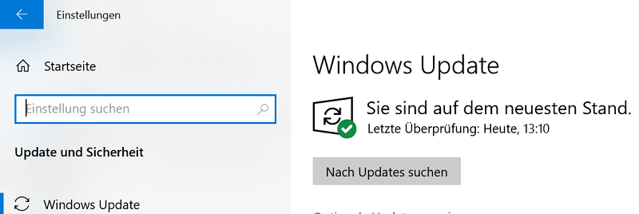
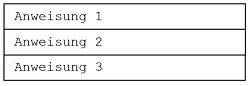

<p xmlns:cc="http://creativecommons.org/ns#" xmlns:dct="http://purl.org/dc/terms/"><a property="dct:title" rel="cc:attributionURL" href="https://github.com/jfarmer20/1POS_C_Theorie/blob/main/1POS_C_SKRIPTUM_FA.md">Unterrichtsskriptum "Programmieren und Software Engineering", Erster Jahrgang der Abteilung Informatik, HTBLA-Kaindorf an der Sulm, Austria, Europe</a> by <a rel="cc:attributionURL dct:creator" property="cc:attributionName" href="https://github.com/jfarmer20">Johannes Farmer </a> is licensed under <a href="http://creativecommons.org/licenses/by-sa/4.0/?ref=chooser-v1" target="_blank" rel="license noopener noreferrer" style="display:inline-block;">CC BY-SA 4.0</a></p>

# Allgemeines <!-- omit in toc -->

Dieses Skriptum umfasst den Unterrichtsstoff für POS (Programmieren und Software Engineering) des ersten Jahrgangs der Abteilung Informatik an der Höheren Technischen Bundeslehranstalt Kaindorf, Österreich. 

Als Erweiterung dieses Skriptums steht das frei verfügbare Lehrbuch zur Programmiersprache C des Rheinwerk Verlags zur Verfügung:  
[Wolf, Jürgen: C von A bis Z](https://openbook.rheinwerk-verlag.de/c_von_a_bis_z/)

Werden die Grundlagen beherrscht, können die Programmierfähigkeiten auf folgenden Seiten perfektioniert werden: 

[Project Euler](https://projecteuler.net/)  
[CodinGame](https://www.codingame.com/start)  

# Inhaltsverzeichnis <!-- omit in toc -->

- [1. Einführung](#1-einführung)
  - [1.1. Begriffe](#11-begriffe)
  - [1.2. Geschichtliches der Programmiersprache C](#12-geschichtliches-der-programmiersprache-c)
- [2. Installation der Programmierumgebung auf Windows 10](#2-installation-der-programmierumgebung-auf-windows-10)
  - [2.1. Installationsanleitung für *Visual Studio Code (VS Code)* auf *Windows 10* mit *MinGW*](#21-installationsanleitung-für-visual-studio-code-vs-code-auf-windows-10-mit-mingw)
  - [2.2. Installationsanleitung für *Visual Studio Code (VS Code)* auf *Windows 10* mit *Windows Subsystem for Linux (WSL)*](#22-installationsanleitung-für-visual-studio-code-vs-code-auf-windows-10-mit-windows-subsystem-for-linux-wsl)
  - [2.3. Erstes Programm mit Visual Studio Code (VS Code)](#23-erstes-programm-mit-visual-studio-code-vs-code)
  - [2.4. `helloworld.c` kompilieren](#24-helloworldc-kompilieren)
  - [2.5. `helloworld.c` starten/debuggen](#25-helloworldc-startendebuggen)
    - [2.5.1. Wichtige Tastenkombinationen](#251-wichtige-tastenkombinationen)
    - [2.5.2. Zugriff Dateisystem Windows <-> WSL](#252-zugriff-dateisystem-windows---wsl)
  - [2.6. Einführungsbeispiel](#26-einführungsbeispiel)
- [3. Mein erstes Programm mit Eingabe, Zuweisung und Ausgabe](#3-mein-erstes-programm-mit-eingabe-zuweisung-und-ausgabe)
  - [3.1. `printf()`-Befehl: Steuerzeichen und Sonderzeichen](#31-printf-befehl-steuerzeichen-und-sonderzeichen)
  - [3.2. Struktogramm](#32-struktogramm)
- [4. Operatoren – 1. Teil](#4-operatoren--1-teil)
  - [4.1. Zuweisungsoperator](#41-zuweisungsoperator)
    - [4.1.1. Variablentausch mit Hilfsvariable](#411-variablentausch-mit-hilfsvariable)
    - [4.1.2. Variablentausch ohne Hilfsvariable](#412-variablentausch-ohne-hilfsvariable)
  - [4.2. Arithmetische Operatoren](#42-arithmetische-operatoren)
    - [4.2.1. Vorzeichenoperatoren](#421-vorzeichenoperatoren)
    - [4.2.2. Binäre arithmetische  Operatoren](#422-binäre-arithmetische--operatoren)
- [5. Datentypen](#5-datentypen)
- [6. `printf()`-Befehl: Formatierte Ausgabe](#6-printf-befehl-formatierte-ausgabe)
- [7. Zufallszahlen](#7-zufallszahlen)
- [8. Mathematische Funktionen – `<math.h>`](#8-mathematische-funktionen--mathh)
- [9. Kommentare](#9-kommentare)
- [10. Character- und Stringliterale](#10-character--und-stringliterale)
  - [10.1. Characterliterale](#101-characterliterale)
  - [10.2. Stringliterale](#102-stringliterale)
- [11. Operatoren – 2. Teil](#11-operatoren--2-teil)
  - [11.1. Arithmetische  Zuweisungsoperatoren](#111-arithmetische--zuweisungsoperatoren)
  - [11.2. Inkrement- und Dekrementoperatoren `++` und `--`](#112-inkrement--und-dekrementoperatoren--und---)
  - [11.3. Vergleichsoperatoren](#113-vergleichsoperatoren)
  - [11.4. Logische Operatoren](#114-logische-operatoren)
  - [11.5. Die Operatorenrangfolge](#115-die-operatorenrangfolge)
- [12. Kontrollstrukturen – Entscheidung](#12-kontrollstrukturen--entscheidung)
  - [12.1. Die bedingte Verzweigung `if-else`](#121-die-bedingte-verzweigung-if-else)
  - [12.2. Die `switch-case` Anweisung](#122-die-switch-case-anweisung)
- [13. Kontrollstrukturen – Schleifen](#13-kontrollstrukturen--schleifen)
  - [13.1. Die `while`-Schleife](#131-die-while-schleife)
  - [13.2. Die `do-while`-Schleife](#132-die-do-while-schleife)
  - [13.3. Die `for`-Schleife](#133-die-for-schleife)
  - [13.4. Gegenüberstellung `for`-, `while`- und `do-while`-Schleife](#134-gegenüberstellung-for--while--und-do-while-schleife)
  - [13.5. Abbruch einer Schleife mit `break` oder `continue`](#135-abbruch-einer-schleife-mit-break-oder-continue)
  - [13.6. Die `exit()`-Funktion](#136-die-exit-funktion)
- [14. Zahlensysteme: Dezimal-, Binär-, und Hexadezimal-System](#14-zahlensysteme-dezimal--binär--und-hexadezimal-system)
  - [14.1. Umwandlung Dezimal- ins Binärsystem](#141-umwandlung-dezimal--ins-binärsystem)
  - [14.2. Umwandlung Binär- ins Dezimalsystem](#142-umwandlung-binär--ins-dezimalsystem)
  - [14.3. Umwandlung Binär- ins Dezimalsystem (Horner-Schema)](#143-umwandlung-binär--ins-dezimalsystem-horner-schema)
  - [14.4. Umwandlung Binär- ins Hexadezimalsystem und umgekehrt](#144-umwandlung-binär--ins-hexadezimalsystem-und-umgekehrt)
  - [14.5. Das 2er-Komplement](#145-das-2er-komplement)
- [15. Bitoperatoren](#15-bitoperatoren)
  - [15.1. Shiftoperatoren](#151-shiftoperatoren)
- [16. Arrays (Felder) - 1. Teil](#16-arrays-felder---1-teil)
  - [16.1. Eindimensionale Arrays](#161-eindimensionale-arrays)
  - [16.2. Initialisieren von Arrays](#162-initialisieren-von-arrays)
- [17. Funktionen](#17-funktionen)
- [18. Arrays (Felder) - 2. Teil](#18-arrays-felder---2-teil)
  - [18.1. Eindimensionale Arrays dynamisch erzeugen](#181-eindimensionale-arrays-dynamisch-erzeugen)
  - [18.2. Mehrdimensionale Arrays](#182-mehrdimensionale-arrays)
  - [18.3. Übergabe von mehrdimensionalen Arrays an Funktionen](#183-übergabe-von-mehrdimensionalen-arrays-an-funktionen)
  - [18.4. Mehrdimensionale Arrays dynamisch erzeugen](#184-mehrdimensionale-arrays-dynamisch-erzeugen)
- [19. Anhang](#19-anhang)
  - [19.1. Weitere Literatur](#191-weitere-literatur)
  - [19.2. Übersicht des Unterrichtsstoffs](#192-übersicht-des-unterrichtsstoffs)

# 1. Einführung

## 1.1. Begriffe 

Ein **Programm** ist eine Abfolge von Befehlen/Anweisungen in einer bestimmten Programmiersprache. 

Ein **Compiler** übersetzt ein Programm, geschrieben in einer  Programmiersprache (z.B. C, Java, Python) in Maschinensprache (`01100010001`…). 

Ein **Debugger** dient zur Fehlersuche in Programmen. Damit lassen sich Programme Schritt für Schritt ausführen und Variableninhalte anzeigen.  

Eine **Entwicklungsumgebung** oder **IDE** (*Integrated Development Environment*) wie z.B. Visual Studio Code oder IntelliJ unterstützt Programmierer beim 
* Schreiben, 
* Debuggen,  
* Compilieren und 
* Ausführen 

von Programmen.  

Jede Programmiersprache stellt **Befehle** für: 
1.	Eingabe
2.	Ausgabe
3.	Mathematische Operationen
4.	Entscheidungen
5.	Schleifen  

zur Verfügung.  

Zudem stellt jede Programmiersprache **Datentypen** für 
* Ganze Zahlen
* Gleitkommazahlen
* Einen logischen Datentyp
* Zeichen und Zeichenketten (String)

bereit.  

## 1.2. Geschichtliches der Programmiersprache C 
C ist eine imperative und prozedurale Programmiersprache. C wurde 1972 „erfunden“ und seit damals in Varianten weiterentwickelt. Das *American National Standards Institute* (ANSI) vereinheitlichte die C-Varianten und veröffentlichte 1989 ein standardisiertes C. Dieser C-Standard wird im Sprachgebrauch als C89 bzw. ANSI-C bezeichnet. Dieser C-Standard wurde auch von der *International Organization for Standardization* (ISO) übernommen und im Sprachgebrauch mit C90 bezeichnet. 

[ANSI-C Reference Card](http://users.ece.utexas.edu/~adnan/c-refcard.pdf)  

Im Jahr 1999 erschien C99 mit Elementen der objekt-orientierten Programmiersprache C++. 

# 2. Installation der Programmierumgebung auf Windows 10 

Der Compiler `gcc` und der Debugger `gdb`  sind ein wesentlicher Bestandteil des Betriebssystems Linux. Es macht somit Sinn, `C` auf dem Windows Subsystem for Linux (WSL) zu programmieren. Die Installation dafür ist im übernächsten Abschnitt beschrieben.  

Will man `C` auf Windows entwickeln, so ist die Konfiguration der Entwicklungsumgebung einfacher und nachfolgend beschrieben. 

## 2.1. Installationsanleitung für *Visual Studio Code (VS Code)* auf *Windows 10* mit *MinGW*  

MinGW (*Minimalist GNU for Windows*) ist eine Portierung der Entwicklerwerkzeuge GNU Compiler Collection (GCC) und GNU Debugger (GDB) auf Windows.  

1. MinGW-w64 ist auf Sourceforge unter folgendem Link verfügbar: [Mingw-w64 builds](https://www.mingw-w64.org/downloads/#mingw-builds)  

    Starte die Setup-Datei:  

     

         

2. Installiere [Visual Studio Code](https://code.visualstudio.com/Download).

1. Installiere die [C/C++ extension for VS Code](https://marketplace.visualstudio.com/items?itemName=ms-vscode.cpptools).  

    You can install the C/C++ extension by searching for 'c++' in the Extensions view  
    


4. Um zu prüfen, ob die Mingw-w64 Tools richtig installiert sind, offne ein Command Prompt und führe folgendes aus:

    ```
     gcc --version
     gdb --version
     ```  

## 2.2. Installationsanleitung für *Visual Studio Code (VS Code)* auf *Windows 10* mit *Windows Subsystem for Linux (WSL)*  

1. Windows auf die neueste Version aktualisieren: 

    `Start` > `Einstellungen` > `Update und Sicherheit`

      

2. Windows Subsystem für Linux installieren: 

    `Windows Suche` > `cmd` > `Als Administrator ausführen`

     

    `wsl --install` ausführen 

    


    Nach fertiger Installation muss der Rechner neu gestartet werden. 
    Ubuntu Linux installiert sich danach automatisch.  

     


3. Linux-User anlegen: 

    Einfachen Username und leicht zu merkendes Passwort wählen: 

     


4. Visual Studio Code (Windows 10) downloaden und installieren:  

    [Visual Studio Code Download Page](https://code.visualstudio.com/Download)  

5. Erweiterungen für VS Code (`Remote Development`, `C/C++ IntelliSense`) installieren: 

    Die genaue Anleitung, ergänzt mit den nachfolgenden Screenshots, findet sich hier: 

    https://code.visualstudio.com/docs/cpp/config-wsl#_set-up-your-linux-environment

     

     

     

      

## 2.3. Erstes Programm mit Visual Studio Code (VS Code)

Ubuntu starten und in der Shell Projektverzeichnis erstellen und VS Code starten: 

```
mkdir projects
cd projects
mkdir helloworld
cd helloworld
code .
```

Quelldatei “helloworld.c” erstellen: 


```c
// #include bewirkt das Einfügen von Quellcode aus einer anderen  
// Datei. Die Header-Datei stdio.h wird in das Programm eingefügt.  
// Sie beinhaltet die Funktionen, die wir zur 
// (Standard)-Ein/-Ausgabe benötigen 
#include <stdio.h>                          

int main()         // Funktion main() definiert das Hauptprogramm
{                  // definiert den Anfang der Funktion
  printf("Hello World!\n");        // Aufruf der Funktion printf()
  printf("Press a key to continue... ");
  fflush(stdin);
  getchar();
  return 0;                    // Rückgabewert der Funktion main()
}                              // definiert das Ende der Funktion
```

Datei speichern: Menü File -> Save 

## 2.4. `helloworld.c` kompilieren 
Um VS Code zu sagen, wie die Quelldatei `helloworld.c` nun zu kompilieren ist, braucht es eine `tasks.json` Datei: 	

Menü `Terminal` > `Configure Default Build Task…` > `C/C++:gcc build active file` auswählen. 

Quelldatei `helloworld.c` auswählen  


und mit der Tastenkombination `Strg` + `Shift` + `B` kompilieren. 

## 2.5. `helloworld.c` starten/debuggen 

Um `helloworld.c` starten oder debuggen zu können, braucht VS Code die Datei `launch.json`: 

Menü `Run` > `Add Configuration…` > `C++ (GDB/LLDB)` und `gcc.exe – Build and debug active file` auswählen. 

Das Programm wird anschließend gleich ausgeführt, was man mit der Tastenkombination Shift+F5 stoppen kann. 

Quelldatei helloworld.c auswählen 

 

und mit der Tastenkombination Strg+F5 starten. 

Will man das Programm debuggen, an geeigneter Stelle einen Breakpoint setzen und das Programm mit der Taste F5 starten: 

 

### 2.5.1. Wichtige Tastenkombinationen 

- Strg + Shift + B: Programm kompilieren 
- Strg + F5 / F5: Programm starten / debuggen  
- Strg + Ö: Terminal anzeigen  

- Quellcode formatieren: Shift + Alt + F 
- Kommentar toggle/untoggle: Strg + #
- Speichern / Speichern als: Strg + S / Strg + Shift + S
- Drucken: F1 > 'PrintCode'
- Schrift größer/kleiner: Strg + '+'/'-'
- Light-/Dark-Modus umschalten: Strg+K + Str+T
- Alles Auswählen: Strg + A
- In Zwischenablage kopieren: Strg + C
- Aus Zwischenablage einfügen: Strg + V  

Drucken erfordert in VS Code die Extension [Print, PD Consulting](https://marketplace.visualstudio.com/items?itemName=pdconsec.vscode-print). Wird *remote* unter WSL entwickelt, erfordert die Ubuntu-Installation das Paket `xdg-utils`. Nachzuinstallieren mit folgendem Kommando:  
`sudo apt-get install xdg-utils` 

### 2.5.2. Zugriff Dateisystem Windows <-> WSL

Linux Shell: Zugriff aufs Benutzerverzeichnis in Windows:  
`/mnt/c/Users/<USERNAME>`

Windows-File-Explorer: Zugriff aufs WSL home-Verzeichnis:  
`\\wsl$\Ubuntu\home\<USERNAME>`

## 2.6. Einführungsbeispiel 

Lernt man eine neue Programmiersprache, dann ist meist ein „Hello World“ Programm, das erste Programm, das man schreibt. Und das machen wir im folgenden Einführungsbeispiel genauso. 

Das folgende „Hello World“ Programm zeigt die grundlegende Struktur eines C-Programms: 

```c 
// #include bewirkt das Einfügen von Quellcode aus einer anderen 
// Datei. Die Header-Datei stdio.h wird in das Programm eingefügt. 
// Sie beinhaltet die Funktionen, die wir zur 
// (Standard)-Ein/-Ausgabe benötigen 
#include <stdio.h>                        

int main()          // Funktion main() definiert das Hauptprogramm
{                   // definiert den Anfang der Funktion
  printf ("Hello World!\n");       // Aufruf der Funktion printf()
  return 0;         // Rückgabewert der Funktion main()
}                   // definiert das Ende der Funktion
```
**Erklärungen:**

* die Funktion `main()` muss in jedem C-Programm genau einmal vorhanden sein 
* die geschweiften Klammern definieren einen Funktionskörper oder Block 
* `printf()` ist eine Funktion zur formatierten Ausgabe auf der Konsole 
* Parameter der Funktion `printf()` ist hier der String `"Hello World!\n"`
Die Datei `stdio.h` muss inkludiert sein.
* die Zeichenkombination `'\n'` ist das Steuerzeichen für „Zeilenende“  
* Jede Anweisung wird mit `;` beendet 
* Mehrzeilige Kommentare werden in `/*` und `*/` eingeschlossen
* Einzeilige Kommentare beginn mit `//` und erstrecken sich bis zum Zeilenende
* C unterscheidet zwischen Groß- und Kleinschreibung 

Das folgende Listing zeigt eine modifizierte Version des „Hello World“ Programms:

```c 
#include <stdio.h>
int main()
{
  printf ("Hello");
  printf (" World!");
  printf ("\n");
  return 0;
}
```

# 3. Mein erstes Programm mit Eingabe, Zuweisung und Ausgabe 

Im folgenden Listing werden  

* Die Variable a und b vom Datentyp `int` (Integer … Ganzzahl) eingelesen. 
* Aus den beiden Summanden `a` und `b` die Summe `s` gebildet. 
* Die Rechnung formatiert ausgegeben.  

```c
#include <stdio.h>

int main()
{
    int a = 0;
    int b = 0;
    int s = 0;
    printf("Bitte Summanden 1 eingeben: ");
    scanf("%d", &a);
    printf("Bitte Summanden 2 eingeben: ");
    scanf("%d", &b);
    s = a + b; 
    printf("-------------------------------\n");
    printf("Die Summe von %d und %d ergibt %d\n\n", a, b, s); 
    return 0;
}
```

Erklärungen: 

* Beim `scanf()`-Befehl, dient `%d` als Platzhalter, um den vom Anwender eingegebenen Wert einzulesen und der Variable `a` bzw. `b` zuzuweisen. 
* `%d` ist ein Platzhalter für eine Ganzzahl (d … decimal) 
* Die Platzhalter für die Ausgabe der Variablen `a`, `b` und `s` mit dem `printf()`-Befehl sind gleich wie beim `scanf()`-Befehl. 
* Das `&`-Zeichen im scanf()-Befehl wird zu einem späteren Zeitpunkt erklärt. 

## 3.1. `printf()`-Befehl: Steuerzeichen und Sonderzeichen 

Sogenannte Escape-Sequenzen ermöglichen Steuerzeichen und Sonderzeichen auszugeben. Eine Escape-Sequenz wird durch einen Backslash `\` (Tastenkombination `alt gr` und `ß`) eingeleitet, dem ein weiteres Zeichen folgt. Eine Escape-Sequenz gilt trotzdem als einzelnes Zeichen.
In der folgenden Tabelle sind die wichtigsten Escape-Sequenzen aufgelistet: 

| Escape-Sequenz | Bedeutung |
| --- | --- |
| `\n` | Zeilenumbruch |
| `\t` | Tabulator |
| `\'` | Einfaches Hochkomma |
| `\"` | Doppeltes Hochkomma |
| `\?` | Fragezeichen |
| `\\` | Backslash |
| `\0` | NULL zum Terminieren von Strings |
| `\b` | Backspace - Zurücksetzen um ein Zeichen |
| `\f` | Formfeed - Seitenumbruch |
| `\a` | Piepston |

## 3.2. Struktogramm 

Mit Struktogrammen, auch Nassi-Shneiderman-Diagramme genannt, werden Programme unabhängig von der Programmiersprache, mit der sie letztendlich umgesetzt werden, entworfen.   
Ein Struktogramm setzt sich aus Strukturblöcken zusammen. Diese können, wie wir noch sehen werden, ineinander verschachtelt sein. 

Beispiel eines Struktogramms mit Sequenz-Symbolen: 

 

**Aufgabe**: Lese eine Ganzzahl ein, erhöhe diese um eins und gib die Zahl aus. 

Struktogramm: 

 

Programm: 

```c
#include <stdio.h>

int main()
{
    int zahl;                        // ROT  
    printf("Ganze Zahl: ");          // ROT
    scanf("%d", &zahl);              // ROT
    zahl = zahl + 1;                 // GRÜN
    printf("Ergebnis: %d\n", zahl);  // BLAU
    return 0;
}
```

**Vorteil von Struktogrammen**:  
Man braucht sich beim Entwurf des Programms noch nicht mit Befehls- und Datentypdetails einer Programmiersprache auseinandersetzen. 

# 4. Operatoren – 1. Teil  

Es gibt in C drei Arten von Operatoren:
* Unäre Operatoren: benötigen nur einen Operanden, wie z.B. die Vorzeichenoperatoren `+` und `-`.
* Binäre Operatoren: benötigen zwei Operanden
* Ternäre Operatoren: benötigen drei Operanden

Im folgenden Abschnitt werden die wichtigsten Operatoren beschrieben:

## 4.1. Zuweisungsoperator 

Der Zuweisungsoperator `=` weist der Variablen auf der linken Seite den Wert des Ausdrucks der rechten Seite zu. 

### 4.1.1. Variablentausch mit Hilfsvariable 

Oft müssen die Inhalte zweier Variablen (z.B. a, b) vertauscht werden. Am einfachsten macht man das mit einer Hilfsvariablen h: 

```c
int a, b, h; 
...
h=a;
a=b;
b=h;
```

### 4.1.2. Variablentausch ohne Hilfsvariable 

Mathematikfüchse kommen ohne Hilfsvariable aus: 

```c 
int a, b; 
...
a=a+b;
b=a-b;
a=a-b;
```

## 4.2. Arithmetische Operatoren 

### 4.2.1. Vorzeichenoperatoren

Zur Darstellung der mathematischen Vorzeichen 'plus' und 'minus' werden die unären Vorzeichenoperatoren `+` und `–` verwendet.

```c
int z1, z2;
z1 = +5;
z2 = -9;
```
### 4.2.2. Binäre arithmetische  Operatoren

| Operator | Bedeutung |
| :---: | --- |
| `+` |	Addition |
| `-` |	Subtraktion |
| `*` |	Multiplikation |
| `/` |	Division |
| `%` |	Modulo-Division |

Regeln für die arithmetischen Operatoren: 

Wie in der Mathematik gilt Punkt- vor Strichrechnung, wobei der Modulooperator ein Punktoperator ist.

Gleichrangige Operatoren werden von links nach rechts ausgewertet.

* Sind beide Operanden vom selben Datentyp so ist auch das Ergebnis der Berechnung von diesem Datentyp, mindestens jedoch vom Typ `int`.
  
Sind die Operanden von unterschiedlichen Datentypen, so ist das Ergebnis vom größeren der beiden Datentypen.
* Der Modulooperator ist nur für ganzzahlige Operanden zulässig. Das Ergebnis ist der ganzzahlige Rest der Division: `17 % 5 = 2`.
Bei den Divisionsoperatoren (`/` und `%`) führt eine Divison durch `0` zu einem Laufzeitfehler.  

# 5. Datentypen

In C gibt es viele Datentypen. Die fett markierten werden hauptsächlich in unserem weiteren Unterricht verwendet.  

| Name | Datentyp | Bytes |	Minimalwert | Maximalwert | Formatzeichen |  
| --- | --- | :---: | --- | --- | --- |  
| **`char`** | Ein Zeichen | 1 | -128 () | 127 () | `%c`  
| **`char[]`** | Eine Zeichenkette (String) | - | - | - | `%s` |  
| **`int`** | Ganze Zahl | 4 | () | () | `%d`  
| `float` |	Fließkommazahl, 6-stellige Genauigkeit | 4 | 1.2E-38 | 3.4E+38 | `%f` 
| **`double`** | Fließkommazahl, 15-stellige Genauigkeit | 8 | 2.3E-308 | 1.7E+308 | `%lf`
| `short`| Ganze Zahl | 2 | –32.768 | +32.767 | `%d`  
| `long`|  Ganze Zahl | 4 | () | () | `%ld`  

In C existiert kein logischer Datentyp `boolean`. Stattdessen werden Variablen vom Datentyp `int` für Bedingungen verwendet werden, wobei folgende Regeln gelten:

Variablenwert gleich 0 -> `FALSE`  
Variablenwert ungleich 0 -> `TRUE`

Alle Variablen müssen vor ihrer Verwendung **deklariert** werden. Die Deklaration legt den Namen und den Typ fest.  

Für ganzzahlige Datentypen als auch `char` können die Prefixe `signed` und `unsigned` verwendet werden. Insbesondere bei Bitoperationen ist das letztere Prefix von Bedeutung.  
Mit dem `sizeof(`*type name*`)`-Operator lässt sich die Anzahl an Bytes feststellen, die ein Datentyp oder eine Variable im Speicher belegen. 

# 6. `printf()`-Befehl: Formatierte Ausgabe 

Die formatierte Ausgabe auf der Konsole erfolgt mit dem `printf()`-Befehl, der in der Headerdatei `<stdio.h>` definiert ist: 

```c
int printf("Formatstring" [ , argument1, argument2 ...]); 
```

Der erste Parameter dient zur Übergabe eines Formatstrings. Die weiteren Parameter sind optional (eckige Klammern bedeuten optional) und sind die Argumente für den Formatstring. Die Formatierung erfolgt entsprechend den Angaben im Formatstring. Der Rückgabewert des `printf()`-Befehls ist die Anzahl der ausgegebenen Zeichen.

Der Formatstring enthält sowohl normalen Text als auch Platzhalter mit den jeweiligen Formatangaben. Die Syntax für einen Platzhalter sieht wie folgt aus:

``` 
%[flag][width][.precision]conversion
```

Der wichtigste und einzige nicht optionale Teil ist dabei das Umwandlungszeichen (conversion), das den Datentyp für die Umwandlung bestimmt:

| `conversion` | Datentyp | Bedeutung |
| --- | --- | --- | 
| `d`, `i` | int | Integer |
| `f` | float | Gleitkommazahl float - Default von 6 Kommastellen |
| `lf` | double	| Gleitkommazahl double - Default von 6 Kommastellen |
| `%` | | Ausgabe des % Zeichens |


Die Flags sind optional und werden unmittelbar nach dem `%`-Zeichen angegeben:


| `flag` | Bedeutung | 
| --- | --- |
| `-` |	Ausgabe linksbündig |
| `+` |	Ausgabe mit Vorzeichen |
| `0` |	Leerstellen werden mit Nullen gefüllt |

Die Anzahl der auszugebenden Zeichen ist optional und wird durch die Breite (`width`) festgelegt. 

Die Anzahl der Nachkommastellen ist optional und wird durch die Genauigkeit (`precision`) festgelegt. 

Beispiele von Formatangaben für ganzzahlige Werte (Datentyp `int`): 

```
%d 		Ausgabe der Zahl ohne zusätzliche Vorgabe 
%5d 	rechtsbündige Ausgabe der Zahl auf 5 Stellen 
%-5d 	linksbündige Ausgabe der Zahl auf 5 Stellen 
%05d 	Ausgabe der Zahl auf 5 Stellen mit führenden Nullen 
%+5d 	rechtsbündige Ausgabe der Zahl auf 5 Stellen mit Vorzeichen 
%+-5d   linksbündige Ausgabe der Zahl auf 5 Stellen mit Vorzeichen 
```

Beispiele von Formatangaben für Fließkommazahlen (Datentyp `float`):

```
%f 		    Ausgabe der Zahl ohne zusätzliche Vorgabe 
%10f 		rechtsbündige Ausgabe der Zahl auf 10 Stellen
%.2f 		rechtsbündige Ausgabe der Zahl mit 2 Nachkommastellen 
%-10.2f 	linksbündige Ausgabe auf 10 Stellen, davon 2 Nachkommastellen 
%010.2f 	Ausgabe der Zahl auf 10 Stellen mit führenden Nullen, davon 2       
            Nachkommastellen
%+10.2f 	rechtsbündige Ausgabe der Zahl auf 10 Stellen und Vorzeichen,  
            davon 2 Nachkommastellen  
%+-.2f 	    linksbündige Ausgabe der Zahl mit Vorzeichen und 2 Nachkommastellen
```  

# 7. Zufallszahlen 

Zum Erzeugen von ganzzahligen Zufallszahlen stehen in der C Standard Library `<stdlib.h>` folgende Funktionen zu Verfügung:

```c 
srand(<seed>)       // Anweisung zum Erzeugen eines Zufallszahlen-Seeds
srand(time(NULL))   // Erzeugen eines Zufallszahlen-Seeds,  
                    // initialisiert mit der aktuellen Systemzeit   
rand()              // Erzeugen einer ganzzahligen Zufallszahl
```

Für die Funktion `time()` muss zusätzlich die Header-Datei `<time.h>` inkludiert werden. Die Funktion `srand()` definiert den Startwert (Seed) zum Erzeugen der Zufallszahlen. Durch die Übergabe der Funktion `time()` an `srand()` wird sichergestellt, dass bei jedem Programmstart neue Zufallszahlen erzeugt werden. 
Die Funktion `rand()` gibt eine Zufallszahl im Bereich von `[0,RAND_MAX]` zurück. Durch Verwendung des Modulo-Operators (`%`) kann der Wertebereich eingeschränkt werden. 

Benötigt man eine Zufallszahl im Intervall `[Untergrenze, Obergrenze]` gilt folgende Formel: 
```c 
rand()%(Obergrenze + 1 – Untergrenze) + Untergrenze
```
Im folgenden Beispiel wird eine Zufallszahl zwischen `[1, 100]` erzeugt:

```c
#include <stdlib.h>
#include <time.h>

int main()
{
  int zz;
  srand(time(NULL));
  zz = rand()%100 + 1; 
}
```

Wird eine Zufallszahl vom Datentyp `double` benötigt, so lässt sich folgende Formel anwenden: 

```c 
(double)rand()/RAND_MAX*(Obergrenze – Untergrenze) + Untergrenze
```

Im folgenden Beispiel wird eine Zufallszahl zwischen `[1.0, 5.0]` erzeugt:

```c 
#include <stdlib.h>
#include <time.h>

int main()
{
  double zz;
  srand(time(NULL));
  zz = (double)rand()/RAND_MAX*(5.0-1.0) + 1.0; 
}
```  

# 8. Mathematische Funktionen – `<math.h>`

In der Headerdatei `<math.h>` sind folgende nützliche mathematische Funktionen und Konstanten deklariert: 

```
double pow(double x, double y)	// x hoch y
double sqrt(double x)	        // Wurzel aus x
double fabs(double z)           // Absolutwert von x
double sin(double x)	        // Sinus von x
double cos(double x)	        // Cosinus von x
double tan(double x)	        // Tangens von x
double exp(double x)	        // Exponentialfunktion e hoch x
double log(double x)	        // Natuerlicher Logarithmus von x

M_PI 	// symbolische Konstante für PI
M_PI_2 	// symbolische Konstante für PI/2
M_PI_4 	// symbolische Konstante für PI/4
M_E 	// symbolische Konstante für e 
```

Fürs kaufmännisch Runden, Abschneiden, Abrunden und Aufrunden stehen folgende Funktionen zur Verfügung: 

```
double round(double x);  // Kaufmännisch Runden 
double trunc(double x);  // Kommazahlen abschneiden
double floor(double x);  // auf nächste Ganzzahl abrunden 
double ceil(double x);	 // auf nächste Ganzzahl aufrunden 
```

Im folgenden Beispiel wird die Verwendung der Funktionen veranschaulicht: 

```c
#include <stdlib.h>
#include <math.h>

int main()
{
    double x1, x2, y1, y2; 
    x1 = 5.23487392;
    x2 = 5.89437524;
    y1 = round(x1 * 1000)/1000;  // ergibt 5.235000
    y2 = round(x2 * 1000)/1000;  // ergibt 5.894000
    y1 = trunc(x1);              // ergibt 5.000000
    y1 = floor(x1);              // ergibt 5.000000 
    y1 = ceil(x1);               // ergibt 6.000000 
} 
```

Kaufmännisch Runden und Abschneiden ist auch durch explizite Typumwandlung möglich: 

```c
#include <stdio.h>

int main()
{
    double x1, x2; 
    int y1, y2; 
    double y3, y4; 
    x1 = 5.23487392;
    x2 = 5.89437524;
    // Kaufmännisch Runden:
    y1 = (int)(x1 + 0.5);                // ergibt 5
    y2 = (int)(x2 + 0.5);                 // ergibt 6
    // auf z.B. 3 Kommastellen Runden:
    y3 = (int)(x1 * 1000 + 0.5)/1000.0;  // ergibt 5.235000
    y4 = (int)(x2 * 1000 + 0.5)/1000.0;  // ergibt 5.894000
    // Kommastellen abschneiden:
    y1 = (int)x1;                        // ergibt 5
    // Zahl nach z.B. der 3. Kommastelle abschneiden:
    y3 = (int)(x1 * 1000)/1000.0;        // ergibt 5.234000    
} 
```

# 9. Kommentare 

Regeln für Kommentare:

* Mehrzeilige Kommentare werden mit `/*` eingeleitet und mit `*/` abgeschlossen.
* Einzeilige Kommentare beginnen mit `//` und erstrecken sich bis zum Ende der Zeile.
* Kommentare können an beliebiger Stelle stehen.

# 10. Character- und Stringliterale 

## 10.1. Characterliterale

Die Zuweisung erfolgt durch genau ein Zeichen, das in einfachen Anführungszeichen eingeschlossen wird. Auf der char-Variablen wird der entsprechende ASCII-Wert des Zeichens gespeichert. 

[ASCII-Tabelle](http://www.asciichars.com/)

```c 
char c1, c2, c3;

c1 = 'A';     	// numerischer Wert 65
c1 = 65;      	// identisch zur vorherigen Anweisung
c2 = 'F';     	// numerischer Wert 70
c3 = '1';     	// numerischer Wert 49
c4 = '\n';      // Zeilenumbruch
```

Zu den Characterliteralen gehören auch die Sonder- und Steuerzeichen, die mit einem Backslash '`\`'  eingeleitet werden (Escape-Sequenz) und trotzdem als einzelne Zeichen gelten. 

Das Umwandlungszeichen (conversion), um Characterliterale einzulesen bzw. auszugeben lautet „c“: 

```c
char zeichen; 
scanf("%c", &zeichen);
printf("%c", zeichen);
```

## 10.2. Stringliterale

Für Strings gibt es in C keinen eigenen Datentyp. Zeichenketten werden daher in Form von `char`-Arrays dargestellt. 

Folgende Eigenschaften gelten für Zeichenketten:

* Sie bestehen aus einer Folge von Einzelzeichen. 
* Sie werden mit doppelten Anführungszeichen eingeschlossen:	
 `"Das ist eine Zeichenkette"`. 
* Am Ende muss ein NULL-Zeichen ('`\0`') zur Kennzeichnung des Endes angehängt sein.  
* Zeichenketten können über Zeilengrenzen gehen, wenn unmittelbar vor dem Zeilentrenner ein Backslash '`\`' steht. 
Sie können einem Charaterfeld (`char`-Array) zugewiesen werden.
Sie dürfen nur bei der Initialisierung oder beim Einlesen zugewiesen werden, nicht aber zu einem späteren Zeitpunkt.

```c 
char str1[100] = "";
char str2[] = "Hallo";
char str3[100] = "Hallo"; 
char str4[] = {'H', 'a', 'l', 'l', 'o', '\0'};
char str5[] = {72, 97, 108, 108, 111, 0}; // "Hallo"  
char str6[20] = "Teil 1\
Teil2"; // Der Zeilenumbruch ist auf dem String nicht sichtbar  
str1 = "ungueltige Zuweisung";  // Compilerfehler!
```

Das Umwandlungszeichen (*conversion*), um Stringliterale auszugeben lautet „`%s`“: 

```c 
char str1[] = "Hallo";
printf("%s", str1);
```

Fürs Einlesen von Stringliteralen von der Konsole stehen u.a. die beiden Befehle:  
- `scanf("%s, s)` (*unsafe*, *Buffer-Overflows* möglich) und  
- `fgets(s, ARRAY_SIZE, stdin)` (*safe*)  

zur Verfügung:  

```c
#define SIZE 100
char str1[SIZE] ="";
scanf("%s", str1); 
fgets(str1, SIZE, stdin); 
```
Mit `fgets(s, ARRAY_SIZE, stdin)` werden maximal `ARRAY_SIZE - 1` Stellen eingelesen, weil die letzte Stelle im Array für das NULL-Zeichen ('`\0`') benötigt wird. 

Die Deklaration und Initialiserung `char s[] = "";` erzeugt ein einstelliges `char`-Array mit dem NULL-Zeichen ('`\0`') an Stelle `s[0]` als Inhalt. 

Um die Länge eines Stringliterals feszustellen, steht der Befehl `strlen(s)` zur Verfügung: 

```c 
char str[] = { "Hallo" };
int strLaenge; 
strLaenge = strlen(str); // Laenge ist 6 ("Hallo" + '\0')
```

Der Zugriff auf einzelne Zeichen eines Stringliterals erfolgt folgendermaßen: 

```c 
char str[] = { "Hallo" };
char c; 
c = str[0];    // Weist der Variablen c das Zeichen ‚‘H‘ zu 
```

Zur Umwandlung von Zeichenketten in numerische Werte stehen in der C-Standard Library `<stdlib.h>` unter anderem folgende Konvertierungsfunktionen zu Verfügung: 

```c 
int atoi(<String>)	    // Konvertierung von String in int
double atof(<String>)	// Konvertierung von String in double
```  

# 11. Operatoren – 2. Teil 

## 11.1. Arithmetische  Zuweisungsoperatoren

| Operator | Beispiel |	Bedeutung |
|:----:|:----:|:----:|
| += | a += 2; | a = a+2; | 
| -= | a -= 2; | a = a-2;
| *= | a *= 2; | a = a*2;
| /= | a /= 2; | a = a/2;
| %= | a %= 2; | a = a%2;

Achtung: Die Zuweisung:  
`z1 *= z2 +1;`  
entspricht der Anweisung:  
`z1 = z1 * (z2 +1);`           
und nicht:  
`z1 = z1*z2 +1;`  

Die verkürzte Schreibweise mit den arithmetischen Zuweisungsoperatoren ist dann sinnvoll, wenn dadurch komplexe Ausdrücke leichter lesbar werden:

`feld[2*i+j-4] = feld[2*i+j-4] + 2;` // normale Schreibweise  
`feld[2*i+j-4] += 2;`                // verkürzte Schreibweise  

## 11.2. Inkrement- und Dekrementoperatoren `++` und `--`  

Diese beiden unären Operatoren werden verwendet um das Ergebnis des Operanden um 1 zu erhöhen oder um 1 zu vermindern. Sie sind für alle Datentypen zulässig.
Sie können in Präfix- (vor dem Operanden) oder Postfixnotation (nach dem Operanden) verwendet werden.  

Präfixnotation: Der Wert des Operanden ändert sich **vor** seiner weiteren Verwendung.  
`++x`  
`--x`  

Postfixnotation: Der Wert des Operanden ändert sich **nach** seiner weiteren Verwendung.  
`x++`  
`x--`  

Die folgende Tabelle zeigt die unterschiedliche Bedeutung der Operatoren:

| a vorher | Ausdruck | a nachher | b nachher |  
|:----:|:----:|:----:|:----:|
| 10 | b = a++; | 11 | 10 |  
| 10 | b = ++a; | 11 | 11 |  
| 10 | b = a--; | 9 | 10 |  
| 10 | b = --a; | 9 | 9 |  

Die Inkrement- und Dekrementoperatoren können für einzelne Variablen, nicht aber für Zahlen oder Ausdrücke verwendet werden.

Beispiel:
```c  
    int i = 2, j, k = 3;
    j = i++ + k; // = i++ + k
    printf("%d %d %d\n", i, j, k);
    j = i++ + k--; // = i++ + k--
    printf("%d %d %d\n", i, j, k);
    j = i++ + ++k;
    printf("%d %d %d\n", i, j, k);
    j = i++ + ++i;
    printf("%d %d\n", i, j);
    j = (i + k)++; // Compilerfehler!!

    float z = 3.1;
    z++;
    printf("%f\n", z);
```  

Ausgabe:
```  
3 5 3
4 6 2
5 7 3
7 12
4.100000
```

## 11.3. Vergleichsoperatoren  

In C gibt es 6 Operatoren zum Vergleichen von numerischen Datentypen. Das Ergebnis eines Vergleichs ist immer vom Typ `int`, wobei 0 dem Wert falsch und 1 dem Wert wahr entspricht.

| Operator | Bedeutung |  
|:----:|:----:|  
| == | gleich |  
| != | ungleich |  
| < | kleiner |  
| <= | kleiner gleich |  
| > | größer |  
| >= | größer gleich |  

Beispiel:  

```c  
int a = 2, b = 3;
printf("%d == %d ist %d\n", a, b, a == b);
printf("%d != %d ist %d\n", a, b, a != b);
printf("%d == %d ist %d\n", ++a, b, a == b); // Achtung: Call by Value!
```  

Ausgabe:  

```
2 == 3 ist 0
2 != 3 ist 1
3 == 3 ist 0
```

## 11.4. Logische Operatoren  

Logische Operatoren verknüpfen Wahrheitswerte. Da in C die Wahrheitswerte durch ganzzahlige Werte beschrieben werden, können logische Operatoren für alle Datentypen verwendet werden.  

| Operator | Bedeutung |  
|:----|:----|  
| ! | logisches nicht - dreht den Wahrheitswert um |  
| && | logisches und - wahr wenn beide Operanden wahr sind |  
| \|\| | logisches oder - wahr wenn zumindest einer der beiden Operanden wahr ist |  

Die folgende Wertetabelle zeigt alle möglichen Kombinationen der Wahrheitswerte:  

| a | b | !a | a && b | a \|\| b |  
|:----:|:----:|:----:|:----:|:----:|  
| 0 | 0 | 1 | 0 | 0 |  
| 0 | 1 | 1 | 0 | 1 |  
| 1 | 0 | 0 | 0 | 1 |  
| 1 | 1 | 0 | 1 | 1 |  

Die logischen Operatoren `&&` und `||` arbeiten mit der sog. short-circuit-evaluation, d.h. der rechte Operand wird nur dann ausgewertet, wenn das zur Bestimmung eines Ergebnisses notwendig ist.  
Bei  `a && b` wird daher b nur ausgewertet, wenn a=1 ist.  
Bei  `a || b` dagegen wird b nur ausgewertet wenn a=0 ist. 

Der `&&` Operator hat Vorrang vor dem `||` Operator.  
Der Ausdruck  
`a || b && c`  
ist gleichbedeutet mit  
`a || (b && c)`  

Durch die short-circuit-evaluation kann es zu unerwünschten Nebeneffekten kommen, wenn im rechten Teil eines logischen Ausdrucks Variablenänderungen stehen, die durch die verkürzte Auswertung nicht ausgeführt werden.

Beispiel:

```c  
if (a < b && d++) { ... }	// Bedingung mit Nebeneffekt
if (d++ && a < b) { ... }	// Bedingung ohne Nebeneffekt
``` 

Bei der ersten if-Anweisung wird d nur dann erhöht wenn `a < b` wahr ist. Bei der zweiten if-Anweisung wird d in jedem Fall erhöht.  

## 11.5. Die Operatorenrangfolge

Die Rangfolge der Operatoren ist von oben nach unten angeordnet. Operatoren innerhalb derselben Zeilen sind gleichwertig und werden von links nach rechts abgearbeitet.
Durch Verwendung von runden Klammern kann der Vorrag der Operatoren geändert werden.

| Operator-Typ | Operator |  
|:----|:----|  
| unär Postfix | () [] ++ -- |  
| unär Präfix | ++ -- (cast) sizeof |  
| binär Arithmetisch | * / % |  
| binär Arithmetisch | + - |  
| Vergleich | < <= > >= |  
| Vergleich | == != |  
| logisch und | && |  
| logisch oder | \|\| |  
| Zuweisung | += -= *= /= %=  |  
| Komma | , |  

# 12. Kontrollstrukturen – Entscheidung 

C stellt für die Entscheidung folgende zwei Kontrollstrukturen zur Verfügung:  
- Die bedingte Verzweigung: `if-else`  
- Die Fallunterscheidung: `switch-case`  

## 12.1. Die bedingte Verzweigung `if-else`   

Die `if`-Anweisung hat folgende Syntax:

```c  
    if (bedingung)
        anweisung-1;
    else
        anweisung-2;
```  

Die `if`-Anweisung dient zur Auswahl zwischen zwei Möglichkeiten:  
- *bedingung* muss einen Wahrheitswert liefern. Ist *bedingung* wahr, wird *anweisung-1* ausgeführt sonst *anweisung2*  
- Der `else`-Zweig ist optional  
- Anstelle einer einzelnen Anweisung kann auch ein Anweisungsblock, der in `{` `}` eingeschlossen wird, stehen  

Das folgende Beispiel zeigt eine einfache `if`-Anweisungen:  

```c  
    if (stunde < 12)
        printf("Vormittag\n");
    else
        printf("Nachmittag\n");
```  

Bei der Schachtelung von mehreren `if-else`-Anweisungen gehört das `else` zum letzten `if`, das keinen `else`-Zweig hat:

```c  
    int a = 1, b = 2;

    if (a < b)
    {
        printf("a kleiner b\n");
    }
    else if (a > b)
    {
        printf("a groesser b\n");
    }
    else
    {
        printf("a gleich b\n");
    }
``` 

Folgende if-Anweisungen sind äquivalent. Bei der Entscheidung, welche man verwendet, soll man auf Lesbarkeit achten: 

```c
    if (i % k)
        printf("Division mit Rest\n");
        
    if (i % k != 0)
        printf("Division mit Rest\n");
```

```c
    if (x)  
        ...

    if (x != 0)  
        ...
```

Zwei häufige Fehler beim Verwenden der `if`-Aweisung sind das Verwechseln der Bedingung mit einer Zuweisung sowie das Setzen eines Strichpunkts hinter der Bedingung:

```c 
    // Fehler 1:
    if (x = 0)                      // Zuweisung statt Bedingung
        printf("%d\n", x);          // Die printf()-Anweisung wird nie ausgeführt

    // Fehler 2:
    if (a == b);                    // der ; ist eine leere Anweisung
        printf("Werte gleich!\n");  // die printf()-Anweisung wird immer ausgeführt
```

## 12.2. Die `switch-case` Anweisung 

Die `switch-case`-Anweisung hat folgende Syntax:

```c  
    switch (ausdruck)
    {
    case konstante-1:
        anweisung-1;
    case konstante-2:
        anweisung-2;
      ...
    case konstante-n: 
        anweisung-n;
    default:
        anweisung;
    }
```  

Die `switch-case`-Anweisung wird folgendermaßen abgearbeitet:  

1.	Der Ausdruck hinter dem `switch` wird ausgewertet, wobei als Wert nur Ganzzahl-Datentypen wie `char` und `int` erlaubt sind.  
2.	Der Wert des Ausdrucks wird nacheinander mit den Werten von *konstante-1* bis *konstante-n* verglichen. Wird eine Übereinstimmung gefunden, so werden alle folgenden Anweisungen bis zum Ende der `switch`-Anweisung oder bis zum nächsten `break` ausgeführt. 
3.	Wird keine Übereinstimmung des Wertes von *ausdruck* mit einer der angegebenen Konstanten gefunden, so wird der `default`-Zweig und alle folgenden Anweisungen bis zum nächsten `break` ausgeführt.

Weitere Eigenschaften der `switch-case` Anweisung:  

- Jeder Ausdruck *anweisung-i* kann dabei auch aus mehreren Einzelanweisungen oder beliebig komplexen Kontrollstrukturen, wie Schleifen etc.,  bestehen.  
- Der `default`-Zweig ist optional und muss nicht der letzte Zweig in der switch-Anweisung sein.  
- Für den `konstante-i` Ausdruck dürfen keine Variablen verwendet werden.  
- Jeder `konstante-i` Ausdruck muss eindeutig sein, d.h er darf nicht zweimal vorkommen.  
- Es können beliebig viele `case`-Teile vorhanden sein.  
-	Ein `konstante-i` Ausdruck kann auch ohne nachfolgende `anweisung-i` vorkommen.

Das folgende Beispiel zeigt die Arbeitsweise der switch-case Anweisung:

```c 
    switch (punkte)
    {
    case 50:
        printf("Sehr gut\n");
        break;
    case 40:
        printf("Gut\n");
        break;
    case 30:
        printf("Befriedigend 3\n");
        break;
    case 20:
        printf("Genügend 4\n");
        break;
    default:
        printf("Nicht genügend\n");
    }
```

In diesem Beispiel wird für 50 Punkte "Sehr gut" ausgegeben, für 40 Punkte "Gut" usw. Für alle anderen Punktezahlen, wie z.B. 42 wird  "Nicht genügend" ausgegeben (Dieses Beisiel macht somit keinen Sinn).  

Im folgenden Beispiel werden jeweils zwei Konstante von einem Anweisungsblock behandelt:

```c
    printf("\nBitte geben Sie Ihre Farbwahl ein: ");
    switch (c = getchar())
    {
    case 'r':
    case 'R':
        printf("\nSie haben rot gewaehlt\n");
        break;
    case 'b':
    case 'B':
        printf("\nSie haben blau gewaehlt\n");
        break;
    case 'g':
    case 'G':
        printf("\nSie haben gelb gewaehlt\n");
        break;
    default:
        printf("\nFalsche Farbwahl!\n");
    }
```

# 13. Kontrollstrukturen – Schleifen  

C stellt folgende drei Schleifen zur Verfügung:  
- Die `while`-Schleife  
- Die `do-while`-Schleife  
- Die `for`-Schleife  

## 13.1. Die `while`-Schleife

Die `while`-Schleife hat folgende Syntax:

```c  
while (bedingung)
  anweisung;
```  

Eigenschaften der `while`-Schleife:  
- Die Bedingung wird vor jedem Schleifendurchgang geprüft.  
- Die Schleife wird solange wiederholt, solange *bedingung* wahr ist, d.h.ungleich 0, ist.  
- Die `while`-Schleife ist kopfgesteuert und hat eine Laufbedingung.  
- Anstelle einer einzelnen Anweisung kann ein geklammerter Anweisungsblock `{` `}` stehen. 

  

**Beispiel** 

Mit einem Würfel wird, solange die Augensumme < 100 ist, gewürfelt. Wie oft gewürfelt wird, wird mitgezählt. 


	
```c
#include <stdio.h>
#include <stdlib.h>
#include <time.h>

int main()
{
    int augensumme = 0;
    int anzahlWuerfe = 0;
    int wert;

    srand(time(NULL));

    while (augensumme < 100)
    {
        wert = rand() % 6 + 1;
        augensumme = augensumme + wert;
        anzahlWuerfe = anzahlWuerfe + 1;
    }
    printf("Mit %d Wuerfen wurde die Augensumme %d gewuerfelt.\n", 
        anzahlWuerfe, augensumme);

    return 0;
}
```

## 13.2. Die `do-while`-Schleife

Im Gegensatz zur `while`-Schleife wird bei der `do-while`-Schleife die Laufbedingung am Ende überprüft. Es handelt sich um eine fußgesteuerte Schleife. Die Syntax der `do-while`-Schleife lautet wie folgt:


```c 
do  
  anweisung;  
while (bedingung); 
```  

Eigenschaften der do-while-Schleife:  

- Die Bedingung wird am Ende jedes Schleifendurchgangs geprüft.  
- Die Schleife wird zumindest einmal durchlaufen.  
- Die Schleife wird solange wiederholt solange *bedingung* wahr, d.h. ungleich 0, ist.
- Die Schleife ist fußgesteuert und hat eine Laufbedingung.
- Anstelle einer einzelnen Anweisung kann ein geklammerter Anweisungsblock `{` `}` stehen. 
- Der Strichpunkt hinter der Bedingung darf nicht vergessen werden.

  

**Beispiel**  

Ermittle Zufallszahlen zwischen 0 und 100 und summiere die Zahlen auf. Sobald die Summe > 100 ist, soll die Berechnung beendet werden. Die Anzahl der Summanden ist mitzuzählen. 

  

```c
#include <stdio.h>
#include <stdlib.h>
#include <time.h>

int main()
{
    int summe = 0;
    int anzahl = 0;
    int zufallszahl;

    srand(time(NULL));

    do
    {
        zufallszahl = rand() % 101;
        summe = summe + zufallszahl;
        anzahl = anzahl + 1;
    } while (summe <= 100);
    
    printf("Mit %d Summanden wurde die Summe von %d erreicht.\n",
           anzahl, summe);

    return 0;
}
```  

## 13.3. Die `for`-Schleife

Die `for`-Schleife hat folgende Syntax:  

```c  
for (intialisierung; bedingung; update)
  anweisung;
```    

Die `for`-Schleife wird folgendermaßen abgearbeitet:  

1.	Vor dem ersten Schleifendurchlauf wird der Ausdruck *intialisierung* ausgeführt. Hier werden meistens eine oder mehrere (Lauf-)Variablen initialisert.
2.	Vor jedem Schleifendurchlauf wird der *bedingung*-Ausdruck ausgewertet. Wenn das Ergebnis wahr (ungleich 0) ist, wird der Teil *anweisung* der Schleife durchlaufen.
3.	Nach Beendigung jedes Schleifendurchlaufs wird der *update*–Ausdruck ausgeführt. Hier werden zumeist eine oder mehrere Laufvariablen verändert.

Eigenschaften der for-Schleife:  
- Alle drei Ausdrücke *intialisierung*, *bedingung* und *update* sind optional. Der Defaultwert für den Ausdruck *bedingung* ist wahr.
- Anstelle einer einzelnen Anweisung kann ein geklammerter Anweisungsblock `{` `}` stehen. 

  

Weitere Eigenschaften der for-Schleife:  
- Die Laufvariable ist eine lokale Variable ganzzahligen Typs, z.B. `int` oder `char` (also nicht vom Typ double).  
- Start- und Endwert sind Ausdrücke, die zur Laufvariable zuweisungskompatibel sind.  
- In der (Block-)Anweisung darf der Wert der Laufvariable nicht geändert werden.  
 
**Beispiel 1**

Summe der Quadrate der Zahlen von 1 bis 5. 

  

```c  
#include <stdio.h>

int main()
{
    int sum = 0;
    for (int i = 1; i <= 5; i++)
    {
        sum += i * i;
    }
    printf("Summe der Quadrate: %d\n", sum);

    return 0;
}
```  

**Beispiel 2**  

Summe der Wurzeln  der Zahlen von 5 bis 1  

  

```c 
#include <stdio.h>
#include <math.h>

int main()
{
    double sum = 0;
    for (int i = 5; i > 0; i--)
    {
        sum += sqrt(i);
    }
    printf("Summe der Quadratwurzeln: %6.2f\n", sum);

    return 0;
}
```  

Zwei Beispiele für Endlosschleifen:

```c 
    for (;;)       // default-Wert der Bedingung ist wahr
        printf("Endlosschleife\n");

    for (; 5;)     // Bedingung besteht aus Konstanten != 0
        printf("Endlosschleife\n");
```

`for`-Schleifen können beliebig ineinander verschachtelt werden. 

**Beispiel 3**  

Gib alle Variationen mit Wiederholung der Buchstaben `a`, `b` und `c` am Bildschirm aus.  

  

```c
#include <stdio.h>

int main()
{

    int c1, c2, c3;
    int zaehler = 0;
    for (c1 = 'a'; c1 <= 'c'; c1++)
    {
        for (c2 = 'a'; c2 <= 'c'; c2++)
        {
            for (c3 = 'a'; c3 <= 'c'; c3++)
            {
                printf("%c%c%c ", c1, c2, c3);
                zaehler++;
            }
        }
        printf("\n");
    }
    printf("Es gibt %d Variationen mit Wiederholung.\n", zaehler);

    return 0;
}
```

Bildschirmausgabe: 
``` 
aaa aab aac aba abb abc aca acb acc  
baa bab bac bba bbb bbc bca bcb bcc  
caa cab cac cba cbb cbc cca ccb ccc  
Es gibt 27 Variationen mit Wiederholung.  
```  

Sehr häufig werden `for`-Schleifen zum Durchlaufen von Feldern verwendet:

```c 
#include <stdio.h>

#define MAX 10

int main()
{
    int i;
    int array[MAX];
    for (i = 0; i < MAX; i++)      // Feld vorwärts durchlaufen
        array[i] = i;
    for (i = MAX - 1; i >= 0; i--) // Feld rückwärts durchlaufen
        printf("%d ", array[i]);

    return 0;
}
```

Bildschirmausgabe:  

```  
9 8 7 6 5 4 3 2 1 0
```  

## 13.4. Gegenüberstellung `for`-, `while`- und `do-while`-Schleife 

```c
    // for-Schleife  
    for (intialisierung; bedingung; update) 
    {
        anweisung;
    }

    // while-Schleife  
    initialisierung; 
    while (bedingung) 
    {
        anweisung;
        update;
    }

    // do-while-Schleife  
    initialisierung; 
    do
    {
        anweisung;
        update; 
    } while (bedingung);
``` 

**Beispiel**  

Ausgabe der Zahlen 1 bis 5
```c 
    // for-Schleife
    for (i = 1; i <= 5; i++)
        printf("%d\n", i);

    // while-Schleife  
    int i = 1;
    while (i <= 5)
    {
        printf("%d\n", i);
        i++;
    }

    // do-while-Schleife  
    i = 1;
    do
    {
        printf("%d\n", i);
        i++;
    } while (i <= 5);
``` 

## 13.5. Abbruch einer Schleife mit `break` oder `continue`  

Eigenschaften der `break`-Anweisung:  
- Mit `break` kann die aktuell laufende Schleife abgebrochen werden. Das Programm setzt mit der nächsten Anweisung im unmittelbaren Anschluß an die Schleife fort.  
- Bei mehreren ineinander geschachtelten Schleifen wird nur die unmittelbar umgebende Schleife abgebrochen. 
- Mit `break` kann auch die `switch`-Anweisung verlassen werden.

Eigenschaften der `continue`-Anweisung:  
- Dient zum Vorzeitigen Abbruch eines Schleifendurchlaufs.
- Bei `while` und `do-while` wird sofort die Schleifenbedingung geprüft.  
- Bei der `for`-Schleife wird zuerst der update-Ausdruck ausgeführt und danach die Bedingung geprüft.

Beispiel mit `break`-Anweisung:  

```c
int i;
for (i = 1; i <= 5; i++)
{
    if (i == 3)
    {
        break;
    }
    printf("%d\n", i);
}
printf("Der Wert von i nach der Schleife ist %d\n", i);
```

Bildschirmausgabe:  

``` 
1
2
Der Wert von i nach der Schleife ist 3
```  

Beispiel mit `continue`-Anweisung:

```c
int i;
for (i = 1; i <= 5; i++)
{
    if (i == 3)
    {
        continue;
    }
    printf("%d\n", i);
}
printf("Der Wert von i nach der Schleife ist %d\n", i);
```

Bildschirmausgabe:  

``` 
1
2
4
5
Der Wert von i nach der Schleife ist 6
``` 

## 13.6. Die `exit()`-Funktion 

Die `exit()`-Funktion dient zum Beenden des gesamten Programms und hat die Syntax:

```c  
exit(parameter);
```  

Der Parameter muss vom Typ int sein, der Zahlenwert wird vom Betriebssystem bzw. vom Elternprozess ausgewertet. Ist der Wert des Parameters gleich 0 so wurde das Programm korrekt beendet, sonst wird mit dem Parameter eine Fehlernummer übergeben.

Beispiel:

```c 
#include <stdio.h>
#include <stdlib.h>

int main()
{
    char c;
    printf("\nWeitermachen (J/N)? ");
    scanf("%c", &c);
    if (c == 'j' || c == 'J')
        exit(0);
    else
        exit(1);
}
```

# 14. Zahlensysteme: Dezimal-, Binär-, und Hexadezimal-System 

## 14.1. Umwandlung Dezimal- ins Binärsystem  

|   |   |   |
|--:|:--|:--|
| 150d | 0 | *least significant bit (LSB)*	  
| 75 | 1 |		
| 37 | 1 |		
| 18 | 0 |		
| 9  | 1 |		
| 4  | 0 |		
| 2  | 0 |		
| 1  | 1 | *most significant bit (MSB)*	

150d = 1001 0110b = 96h

## 14.2. Umwandlung Binär- ins Dezimalsystem  

```  
150d = 1*10^2 + 5*10^1 + 0*10^0 = 1*100 + 5*10 + 0*1 = 150d  

1001 0110b =  
= 1*2^7 + 0*2^6 + 0*2^5 + 1*2^4 + 0*2^3 + 1*2^2 + 1*2^1 +0*2^0 =  
= 1*128 + 0*64 + 0*32 + 1*16 + 0*8 + 1*4 + 1*2 + 0*1 =  
= 128 + 16 + 4 + 2 =  
= 150d  
```  
**1001 0110b = 150d** 

## 14.3. Umwandlung Binär- ins Dezimalsystem (Horner-Schema)

```  
150d = 0 + 10*(5 + 10*(1))  

1001 0110b =  
= 0 + 2*(1 + 2*(1 + 2*(0 + 2*(1 + 2*(0 + 2*(0 + 2*(1))))))) =  
= 0 + 2*(1 + 2*(1 + 2*(2*(1 + 2*(2*2))))) =  
= 2*(1 + 2*(1 + 4*(1 + 8))) =  
= 2*(1 + 2*(37)) = 
= 150d  
```  
**1001 0110b = 150d**  

## 14.4. Umwandlung Binär- ins Hexadezimalsystem und umgekehrt  

Das Hexadezimalsystem ist eine übersichtlichere Darstellung von Binärzahlen:  

1001 0110b = 96h  

Die Umwandlung von Dezimal- ins Hexadezimalsystem und umgekehrt funktioniert gleich wie die Umrechnung vom Dezimal- ins Binärsystem jedoch:  
- Division durch 16 anstatt 2  
- Multiplikation mit Basis 16 anstatt 2  

```  
59378d : 16 = 3711 : 16 = 231 : 16 = 14 = E
113            51          71 
  17            31          7
   18           15 = F
    2  
```  
**59378d = E7F2h**  

```  
E7F2h = E*16^3 + 7*16^2 + F*16^1 + 2*16^0 = 14*4096 + 7*256 + 15*16 + 2*1 = 59378d  
```  
**E7F2h = 59378d**

|    | Dezimalsystem | Binärsystem | Hexadezimalsystem |  
|:-- | :-- | :-- | :-- |  
| Zur Basis | 10| 2 | 16 |  
| Zeichenvorrat | 0,1 | 0,1,..,7,8,9 | 0,1,..,9,A,B,..,D,E,F |  
| Darstellung | 150d | 1001 0110b | 96h |  

## 14.5. Das 2er-Komplement 

Es gibt verschiedene Möglichkeiten, negative Zahlen im Binärsystem darzustellen. Zum Beispiel, für das Vorzeichen ein separates Bit zu verwendet.  

Das 2er-Komplement verwendet kein separates Vorzeichen-Bit. Dennoch gilt:  
- Hat das MSB den Wert 1 => negative Zahl  
- Ist das MSB 0 => positive Zahl  

Mit 8 Bit lässt sich der Zahlenbereich  
```  
[-2^(8-1); +2^(8-1)-1] ... [-128, 127] 
```  
darstellen. 

Mit 16 Bit:  
```
[-2^(16-1); +2^(16-1)-1] ... [-32768, +32767]  
```  

Negative Binärzahlen werden folgendermaßen kodiert:  
1.	Alle Stellen des positiven Betragwerts der Zahl negieren.  
2.	Den Wert 1 dazu addieren.  

Beispiel Zahl -4d:  
```  
1.	0000 0100b => 1111 1011b
2.	1111 1011b + 1b => 1111 1100b  
```   
Die Umwandlung einer negativen Binärzahl in ihren positiven Betragswert erfolgt genau gleich:  
1.	Alle Stellen der Zahl negieren.  
2.	Den Wert 1 dazu addieren.  

Beispiel Zahl -4d:  
```  
1.	1111 1100b => 0000 0011b
2.	0000 0011b + 1b => 0000 0100b  
```   

Beispiel Zahl 1111 1111b (-1d):  
```  
1.	1111 1111b => 0000 0000b
2.	0000 0000b + 1b => 0000 0001b 
```  

# 15. Bitoperatoren

Mit Bitoperatoren lassen sich einzelne Bits von Variablen verändern. 

| Operator | Bezeichnung | Bedeutung |  
| :--: | :-- | :-- |   
| ~	| Bitweises Komplement | dreht das Bitmuster des Operanden um |  
| &	| Bitweises UND | ergibt 1 wenn beide Bits 1 sind |  
| \| | Bitweises ODER | ergibt 1 wenn zumindest ein Bit 1 ist |  
| ^ | Bitweises XOR | ergibt 1 wenn beide Bits unterschiedlich sind |  
| << | Linksshift |  
| >> | Rechtsshift |  

Die folgende Wertetabelle zeigt die möglichen Kombinationen  

| Bit1 | Bit2 | ~Bit1 | Bit1 & Bit2 | Bit1 \| Bit2 | Bit1 ^ Bit2 |  
| :--: | :--: | :--: | :--: | :--: | :--: |  
| 0 | 0 | 1 | 0	| 0 | 0 |  
| 0	| 1	| 1	| 0	| 1 | 1 |  
| 1	| 0 | 0 | 0 | 1 | 1 |  
| 1	| 1 | 0 | 1 | 1 | 0 |  
  
Beispiel für das bitweise Komplement einer Zahl:  

```C  
short int x = 4; // x = 0000 0000 0000 0100
short int y;

y = ~x;          // y = 1111 1111 1111 1011
printf("Einserkomplement von %d: %d\n", x, y);
y = ~x + 1;      // y = 1111 1111 1111 1100
printf("Zweierkomplement von %d: %d\n", x, y);
```  

Ausgabe:  

```  
Einserkomplement von 4: -5
Zweierkomplement von 4: -4
```  

Beispiele für Bitoperatoren:

```C  
short int a = 13; 	// a = 0000 0000 0000 1101
short int b = 7; 	// b = 0000 0000 0000 0111
short int c;

c = a & b; 	// c = 0000 0000 0000 0101
c = a | b; 	// c = 0000 0000 0000 1111
c = a ˆ b; 	// c = 0000 0000 0000 1010
```  

Die Bitoperatoren lassen sich auch mit dem Zuweisungsoperator kombinieren: 
`&=`, `|=` und `~=`  

Das bitweise ODER kann verwendet werden, um mit Hilfe einer Maske mehrere Bits auf 1 zu setzen, während das bitweise UND verwendet werden kann, um mehrere Bits auf 0 zu setzen. Das folgende Beispiel zeigt den Zusammenhang:  

```C  
short int a = 0x07A9;     // a = 0000 0111 1010 1001

short int maske = 0x1111; // maske = 0001 0001 0001 0001
a |= maske;               // a =     0001 0111 1011 1001

maske = 0x3333; // maske = 0011 0011 0011 0011
a &= maske;     // a =     0001 0011 0011 0001
```  

Bei der `|=` Verknüpfung bleiben alle gesetzten Bits von `a` erhalten, zusätzlich werden die Bits von `maske` in `a` gesetzt. Das folgt aus der Tatsache dass:

`b | 0 = b` und `b | 1 = 1`  

wobei `b` für einen beliebigen Bitwert (0 oder 1) stehen kann.

Bei der `&=` Verknüpfung werden alle Bits die in `maske` 0 sind, in `a` auf 0 gesetzt. Die Bits, die in `maske` auf 1 gesetzt sind bleiben in `a` erhalten. Das folgt aus der Tatsache dass:  

`b & 0 = 0` und `b & 1 = b`  

wobei `b` für einen beliebigen Bitwert (0 der 1) stehen kann.  

## 15.1. Shiftoperatoren  

Der **Linksshiftoperator `<<`** schiebt das Bitmuster um den vom rechten Operanden angegebenen Wert nach links. Es gelten dabei folgende Regeln:  
- Die äußerst linken Bits werden herausgeschoben und gehen verloren.  
- Von der rechten Seite werden Nullen nachgeschoben. 
- Eine Kombination mit dem Zuweisungsoperator (`<<=`) ist möglich.  

Beispiele:

```C  
unsigned char a = 6;  // a = 0000 0110b = 6d  
a = a << 3;           // a = 0011 0000b = 48d  

signed char b = -4;  // b = 1111 1100b = -4d 
b = b << 3;          // b = 1110 0000b = -32d
```  

Das Verschieben nach links entspricht einer Multiplikation mit `2^n`, wobei `n` der Verschiebefaktor ist: `x << n = x * 2^n`  

Der **Rechtsshiftoperator `>>`** schiebt das Bitmuster um den vom rechten Operanden angegebenen Wert nach rechts. Es gelten dabei folgende Regeln:  
- Die äußerst rechten Bits werden herausgeschoben und gehen verloren.  
- Von der linken Seite werden Nullen nachgeschoben wenn:  
  - Die Variable vom Typ `signed` ist und das Vorzeichenbit `0` ist.  
  - Die Variable vom Typ `unsigned` ist.  
- Von der linken Seite werden Einsen nachgeschoben wenn:  
  - Die Variable vom Typ `signed` ist und das Vorzeichenbit `1` ist  
- Eine Kombination mit dem Zuweisungsoperator (`>>=`) ist möglich.  

Das Verschieben nach rechts entspricht einer Division durch `2^n`, wobei `n` der Verschiebefaktor ist: `x >> n = x / 2^n`  

Beispiele:

```C  
unsigned char a = 48;  // a = 0011 0000b = 48d 
a = a >> 3;            //  a = 0000 0110b = 6d

signed char b = -32;  // b = 1110 0000b = -32d
b = b >> 3;           // b = 1111 1100b = -4d
```  
**Fazit**  

Mit den Shiftoperatoren lassen sich Multiplikation und Division mit 2er Potenzen sehr effizient umsetzen. Und das auch mit negative Zahlen, weil diese mit dem 2er Komplement kodiert sind. 

Folgendes Beispiel liest vom Benutzer eine beliebige ganz Zahl ein und gibt diese binärkodiert, gruppiert in Bytes, am Bildschirm aus:    

```C  
    int x;

    printf("Number: ");
    scanf("%d", &x);

    int anzBits = 8 * sizeof(x);
    int i;

    for (i = anzBits - 1; i >= 0; i--)
    {
        printf("%d", (x >> i) & 0x0001);
        if (i % 8 == 0)
        {
            printf(" ");
        }
    }
```  

# 16. Arrays (Felder) - 1. Teil  

## 16.1. Eindimensionale Arrays

Ein Array oder Feld ist eine Datenstruktur, die Werte vom gleichen Datentyp zusammenfasst.  

Syntax:

```  
datentyp feldname[anzahl_der_elemente];  
```  

Für die Arraygröße dürfen nur Konstanten verwendet werden, weil die Arraygröße vom Compiler festgelegt wird.  
Anmerkung: In Java wird die Arraygröße zur Laufzeit festgelegt und daher dürfen auch Variablen verwendet werden.  

Beispiele für gültige Arraydeklarationen:  

```C  
char str[20];    // ein Array von 20 Zeichen
int feld[100];   // ein Array von 100 Ganzzahlen
double val[25];  // ein Array von 25 double Werten

const int XSIZE = 50;
int f[XSIZE];    // ein Array von 50 Ganzzahlen
```  

Der Zugriff auf die Arrayelemente erfolgt mit einem Index, eingeschlossen in eckigen Klammern `[]`. Mit Index `0` wird das erste Arrayelement angesprochen.  

Das folgende Beispiel definiert ein Array für 10 Ganzzahlen, speichert darauf die Quadratzahlen von 1 bis 10 und gibt die Arrayelemente in aufsteigender und absteigender Reihenfolge aus:  

```C  
int main()
{
  int feld[10];              // Array deklarieren
  int i;

  for (i = 0; i < 10; i++)   // Array initialisieren
    feld[i] = (i + 1) * (i + 1);

  for (i = 0; i < 10; i++)   // Array aufsteigend ausgeben
    printf("%4d", feld[i]);
  printf("\n");

  for (i = 9; i >= 0; i--)   // Array absteigend ausgeben
    printf("%4d", feld[i]);
  printf("\n");

  return 0;
}
```  

Testlauf:  
```  
   1   4   9  16  25  36  49  64  81 100
 100  81  64  49  36  25  16   9   4   1
 ```  

Der verwendete Speicherplatz eines Arrays kann mit dem `sizeof()`-Operator bestimmt werden.  

Im folgenden Beispiel wird die Anzahl der Bytes eines Arrays, sowie die Anzahl der Arrayelemente ausgegeben:  

```C  
int main()
{
  int feld[10];

  printf("Anzahl an Bytes:     %d\n", sizeof(feld));
  printf("Anzahl der Elemente: %d\n", sizeof(feld)/sizeof(int));
}
```  

Testlauf:  
```  
Anzahl an Bytes:     40
Anzahl der Elemente: 10
```  

## 16.2. Initialisieren von Arrays

Genauso wie Variablen haben auch Arrayelemente vor ihrer Initialisierung keinen definierten Wert. Arrays können bei ihrer Deklaration durch einen Initialisierungsblock mit Startwerten belegt werden. Der Block wird in geschwungenen Klammern `{}` eingeschlossen und muss bei der Deklaration des Arrays stehen. Die Werte werden durch Beistriche getrennt aufgelistet. 

Es gelten dabei folgende Regeln:
Die Anzahl der Arrayelemente kann weggelassen werden. Die Größe des Arrays ergibt sich aus der Anzahl der Werte im Initialisierungsblock.
Ist die Elementanzahl größer als die Anzahl an Elementen im Initialisierungsblock, so werden die restlichen Elemente mit `0` aufgefüllt.  

Beispiele:  

```C  
int feld1[] = {1, 2, 3}; // Array mit drei Elementen

int feld2[4] = {1, 2}; // feld2[0]=1, feld2[1]=2, feld2[2]=0, feld2[3]=0

int feld3[100] = {0};   // Alle 100 Element werden mit 0 initialisiert
int feld4[100] = {};    // wie feld3

int x = 33;
int feld5[2] = {x, x + 1};  // feld5[0]=33, feld5[1]=34

int feld6[2] = {1, 2, 3};   // Compilerfehler  
```  


Im folgenden Beispiel wird ein eindimensionales Array mit Zufallszahlen zwischen -100 und 100 aufgefüllt. Anschließend wird die größte Zufallszahl ermittelt und mit ihrem Index ausgegeben:

```C  
#define MAX 10 // Symbolische Konstante für die Arraygrösse

int main()
{
  int zz[MAX] = {}; // Initialisieren aller Elemente mit 0
  int i;
  int zMax, zMin;
  int indexMax, indexMin;

  srand(time(NULL)); // Initialisieren des Arrays mit Zufallszahlen
  for (i = 0; i < MAX; i++)
    zz[i] = rand() % 201 - 100;

  zMax = zz[0];
  indexMax = 0;
  for (i = 1; i < MAX; i++) // Bestimmen des Maximums
  {
    if (zMax < zz[i])
      {
        zMax = zz[i];
        indexMax = i;
      }
  }
  printf("Groesste Zufallszahl: %4d\n", zMax);
  printf("Index:                %4d\n", indexMax);

  return 0;
}
```  

Testlauf:  

```  
Groesste Zufallszahl:   81
Index:                   9
```  

# 17. Funktionen  

**To-Do**  

# 18. Arrays (Felder) - 2. Teil  

## 18.1. Eindimensionale Arrays dynamisch erzeugen 

Mit der Funktion `malloc()` lässt sich für ein Array ein zusammenhängender Speicherbereich zur Laufzeit reservieren.  
**Wichtig:** Sobald das Array im Programm nicht mehr benötigt wird, ist der Speicherbereich verlässliche mit der Funktion `free()` wieder freizugeben. 

Im folgende Programm wird ein Array dynamisch erzeugt, initialisiert, am Bildschirm ausgegeben und dessen Speicherbereich am Ende wieder freigegeben. 


Ein dynamisch erzeugtes Feld kann gleich wie statisch erzeugte Felder verwendet werden (z.B. bei Funktionsübergabe, Zugriff auf die einzelnen Elemente). 

```c 
#include <stdio.h>
#include <stdlib.h>

void printArray(int a[], int size)
{
    for (int i = 0; i < size; i++)
    {
        printf("%4d", a[i]);
        if (i % 10 == 9)
            printf("\n");
    }
}

int main()
{
    int *a1;
    int s1 = 100;

    // Array dynamisch erzeugen 
    a1 = (int *)malloc(sizeof(int) * s1);

    // Array initialisieren 
    for (int i = 0; i < s1; i++)
        a1[i] = i;

    // Array ausgeben
    printArray(a1, s1);

    // Reservierten Speicher freigeben 
    free(a1);

    return 0;
}
```

## 18.2. Mehrdimensionale Arrays 

Jede Dimension des Arrays wird über einen eigenen Index angesprochen. 

Syntax der Arraydeklaration: 

```
datentyp arrayName[anzahl_dim1][anzahl_dim2] . . . [anzahl_dimN];
```

Beispiele einer Arraydeklaration: 

```c 
 int f1d[10];                      // 1-dimensionales Feld
 int f2d[10][5];                   // 2-dimensionales Feld: Entspricht einer 
                                   // Tabelle mit 10 Zeilen + 5 Spalten = 50 Elementen
 ```
 
Initialisieren lassen sich mehrdimensionale Arrays wie folgt: 

 ```c
 int f22[][3] = {{1,2,3},          // 2-dimensionales Feld: Entspricht einer 
                 {4,5}};           // Tabelle mit 2 Zeilen + 3 Spalten = 6 Elementen
 int f3d[100][5][2] = {0};         // 3-dimensionales Array mit 100*5*2 = 1000 Elementen 
 ```
 
 ```c 
 int dim1, dim2, dim3, dim4;

 dim1 = sizeof(f1d)/sizeof(int);
 dim2 = sizeof(f2d)/sizeof(int);
 dim3 = sizeof(f22)/sizeof(int);
 dim4 = sizeof(f3d)/sizeof(int);

 printf("Anzahl der Elemente von f1d: %4d\n",dim1);
 printf("Anzahl der Elemente von f2d: %4d\n",dim2);
 printf("Anzahl der Elemente von f22: %4d\n",dim3);
 printf("Anzahl der Elemente von f3d: %4d\n",dim4);
 ```

Testlauf:

```
Anzahl der Elemente von f1d:   10
Anzahl der Elemente von f2d:   50
Anzahl der Elemente von f22:    6
Anzahl der Elemente von f3d: 1000
```

Bei der Initialisierung kann die Größenangabe der ersten Dimension - und nur der ersten Dimension - weggelassen werden. Eventuell nicht initialisierte Elemente werden auf 0 gesetzt.  Die einzelnen Arrayelemente von `f22` werden daher folgendermaßen initialisiert:

```c
f22[0][0] = 1	f22[0][1] = 2	f22[0][2] = 3
f22[1][0] = 4	f22[1][1] = 5	f22[1][2] = 0
````

```c
int f31d[][10][5] = {0};            // Array mit 1*10*5 = 50 Elementen
int f32d[][10][5] = {{0},           // Array mit 3*10*5 = 150 Elementen
                     {0},
                     {0}};  
int f33d[][][10] = {0};             // Compilerfehler!
int aTest[][] = {{1,2},             // Compilerfehler! 
                 {3,4}}; 
```

Die dritte Deklaration führt zu einem Compilerfehler, da mehr als nur die erste Dimension nicht angegeben sind und der Compiler daher die Arraygröße nicht bestimmen kann. 

## 18.3. Übergabe von mehrdimensionalen Arrays an Funktionen 

Gleich wie bei eindimensionalen Arrays, erfolgt auch bei mehrdimensionalen Arrays die Parameterübergabe nach dem *call-by-reference* Prinzip. 

In der formalen Parameterliste muss für jede Dimension ein Klammerpaar `[]` stehen. Die Anzahl der Elemente muss erst ab der zweiten Dimension definiert sein und die Anzahl der Werte jeder Dimension sind zusätzlich als Parameter mitzuübergeben. 

Beispiel: 

```c 
void initArray(int a2d[][10], int rows, int columns);   // Funktionsprototyp

int main()
{
    int a2d[10][10] = {0};
    initArray(a2d, 10, 10);
    . . .
    return 0;
}

void initArray(int a2d[][10], int rows, int columns)
{
    srand(time(NULL));
    int i, j;
    for (i = 0; i < rows; i++)
        for (j = 0; j < columns; j++)
            a2d[i][j] = rand() % 100 + 1;
}
```

## 18.4. Mehrdimensionale Arrays dynamisch erzeugen 

```c 
/* 2D_dyn_array.c */
#include <stdio.h>
#include <stdlib.h>
#define BUF 255

int main(void)
{
    int i, j, zeilen, spalten;
    /* Matrix ist Zeiger auf int-Zeiger. */
    int **matrix;

    printf("Anzahl Zeilen : ");
    scanf("%d", &zeilen);
    printf("Anzahl Spalten: ");
    scanf("%d", &spalten);

    /* Speicher reservieren für die Zeiger auf die einzelnen Zeilen */
    matrix = malloc(zeilen * sizeof(int *));

    /* Speicher für die Zeilen reservieren */
    for (i = 0; i < zeilen; i++)
    {
        matrix[i] = malloc(spalten * sizeof(int));
    }

    /* Array initialisieren */
    for (i = 0; i < zeilen; i++)
        for (j = 0; j < spalten; j++)
            matrix[i][j] = (i * spalten) + j; /* matrix[zeilen][spalten] */

    /* Matrix ausgeben */
    for (i = 0; i < zeilen; i++)
    {
        for (j = 0; j < spalten; j++)
            printf("%4d ", matrix[i][j]);
        printf("\n");
    }

    /* Speicherplatz (in umgekehrter Reihenfolge!) wieder freigeben. */

    /* Zeilen freigeben */
    for (i = 0; i < zeilen; i++)
        free(matrix[i]);
    /* Speicher der Zeiger auf die Zeilen freigeben */
    free(matrix);

    return EXIT_SUCCESS;
}
```

# 19. Anhang 

## 19.1. Weitere Literatur

[Sedgewick, R.; Wayne, K.: Algorithms. Fourth Edition. Pearson Education 2011, HTML-Version](https://algs4.cs.princeton.edu/home/)  

[Sedgewick, R.; Wayne, K.: Algorithms. Fourth Edition. Pearson Education 2011, PDF-Version](https://github.com/Mcdonoughd/CS2223/raw/master/Books/Algorithhms%204th%20Edition%20by%20Robert%20Sedgewick%2C%20Kevin%20Wayne.pdf) 

## 19.2. Übersicht des Unterrichtsstoffs

* Windows-Command-Shell (cmd): `dir`, `mkdir`, `ren`, `rmdir`, `cd`, `copy`, `del`, `help <command>`, … 

* Entwicklungsumgebung [Visual Studio Code](https://code.visualstudio.com/)  

* Programmiersprachenunabhängiger Programmentwurf mittels Struktogrammen (Nassi-Shneiderman-Diagrammen) [Structorizer](https://structorizer.fisch.lu/) 

* Formatierte Ausgabe, `printf()`-Befehl

* Eingabe mit `scanf()`-Befehl und Menüführung, sobald Schleifen bekannt 

* Datentypen für Ganzzahlen, Gleitkommazahlen, Characterliterale. 

* Arithmetische Operatoren (`+`, `-`, `*`, `/`, `%`, `++`, `--`) inklusive Ganzzahl-Division und Modulo

* Arrays mit einfachen Datentypen (auch mit Characterliterale) 

* Vergleichs- und logische Operatoren 

* Entscheidung (if-else, switch-case) 

* Zufallszahlengenerierung, ganzzahlig und mit Gleitkommazahlen

* Kaufmännisch Runden bzw. Abschneiden mit expliziter Typumwandlung (typecast) 

* Schleifen: 
  * while
  * do-while 
  * for (mit inkrementierender und dekrementierender Zählvariable, Inkrement und Dekrement ungleich Schrittweite 1) 
  * `continue`, `break` im Schleifenkontext 
  * Schreibtischtest

* Zahlensysteme: Binär, Dezimal, Hexadezimal; Umwandlung; 2er-Komplement, Horner-Schema in Form von Beispielen 

* Stringliterale 

* Programmstrukturierung mittels Funktionen und Vorwärtsdeklarationen, *call-by-value*, *call-by-reference*, Array-Übergabe 

  **Optional**

* 2-dimensionale Arrays 

* Fehlersuche (mit printf()-Ausgaben, Debugger) 

* Strukturen

* Rekursion versus Iteration (am Beispiel Fakultätsberechnung und Fibonacci-Zahlen) 