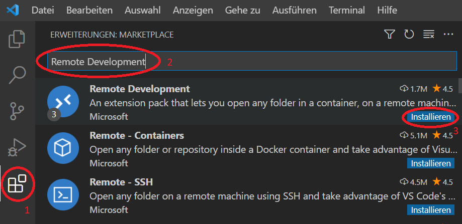
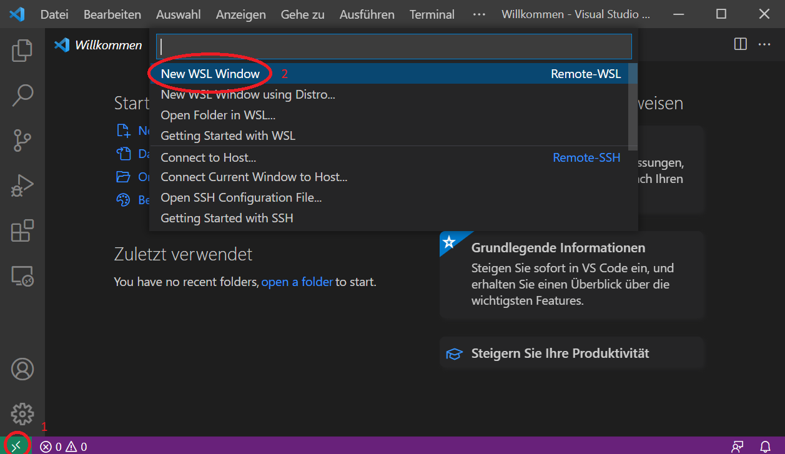

## Installationsanleitung für **Visual Studio Code (VS Code)** auf **Windows 10** und **Windows Subsystem for Linux (WSL)**  

1. Windows auf die neueste Version aktualisieren: 

    `Start` > `Einstellungen` > `Update und Sicherheit`

      

2. Windows Subsystem für Linux installieren: 

    `Windows Suche` > `cmd` > `Als Administrator ausführen`

     

3. Windows Subsystem  für Linux installieren:  

    `wsl --install` ausführen 

    

    Wenn fertig installiert / Nach Auffordung: Rechner neu starten.  
    Danach installiert sich Ubuntu Linux automatisch 

     

4. Linux-User anlegen: 

    Einfachen Username und leicht zu merkendes Passwort wählen: 

     

5. Visual Studio Code (Windows 10) downloaden und installieren:  

    [Visual Studio Code Download Page](https://code.visualstudio.com/Download)  

6. Erweiterungen für VS Code (`Remote Development`, `C/C++ IntelliSense`) installieren: 

    Die genaue Anleitung, ergänzt mit den nachfolgenden Screenshots, findet sich hier: 

    https://code.visualstudio.com/docs/cpp/config-wsl#_set-up-your-linux-environment

     

     

     

      

